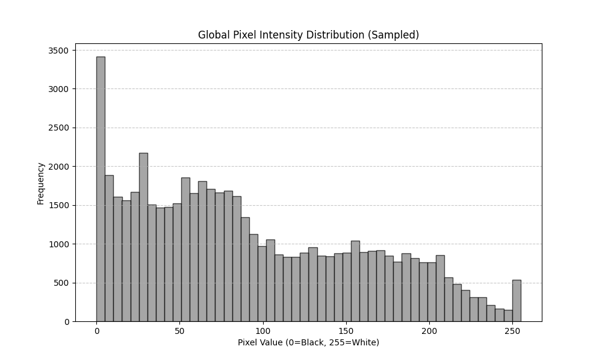
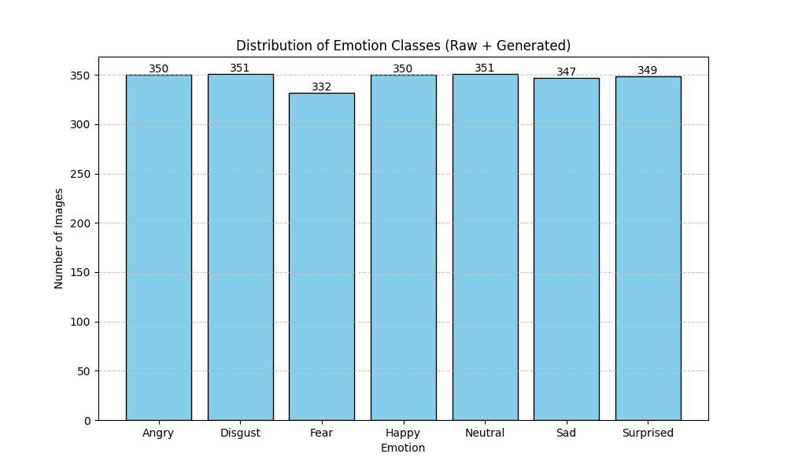
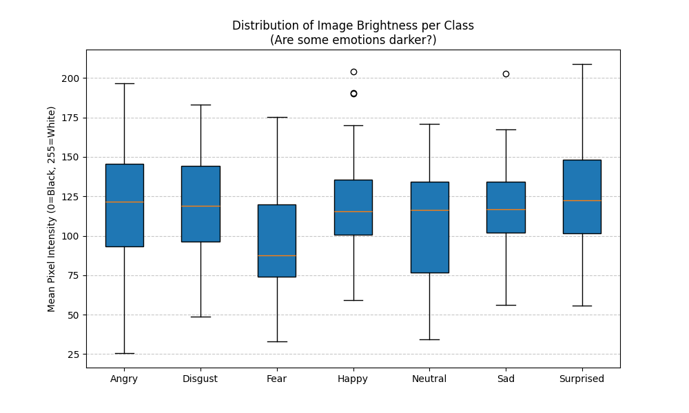

# 📘 README – Etapa 3: Analiza și Pregătirea Setului de Date pentru Rețele Neuronale

**Disciplina:** Rețele Neuronale  
**Instituție:** POLITEHNICA București – FIIR  
**Student:** Ion Radu-Stefan  
**Data:** 20.11.2025

---

## Introducere

Acest document descrie activitățile realizate în **Etapa 3**, în care se analizează și se preprocesează setul de date necesar proiectului „Rețele Neuronale". Scopul etapei este pregătirea corectă a datelor pentru instruirea modelului RN, respectând bunele practici privind calitatea, consistența și reproductibilitatea datelor.

---

##  1. Structura Repository-ului Github (versiunea Etapei 3)

```
project-name/
├── README.md
├── docs/
│   └── datasets/          # descriere seturi de date, surse, diagrame
├── data/
│   ├── raw/               # date brute
│   ├── processed/         # date curățate și transformate
│   ├── train/             # set de instruire
│   ├── validation/        # set de validare
│   └── test/              # set de testare
├── src/
│   ├── preprocessing/     # funcții pentru preprocesare
│   ├── data_acquisition/  # generare / achiziție date (dacă există)
│   └── neural_network/    # implementarea RN (în etapa următoare)
├── config/                # fișiere de configurare
└── requirements.txt       # dependențe Python (dacă aplicabil)
```

---

##  2. Descrierea Setului de Date

### 2.1 Sursa datelor

* **Origine:** [Dataset-ul RAF-DB (Real-world Affective Faces Database)](https://www.kaggle.com/datasets/sanjukinpinem/balanced-raf-db)
* **Modul de achiziție:** Fișier extern (descărcat)
* **Perioada / condițiile colectării:**  Imaginile au fost colectate de pe internet si au fost eitchetate de arpoximativ 40 de annotari

### 2.2 Caracteristicile dataset-ului

* **Număr total de observații:** Aprox. 4566 imagini
* **Număr de caracteristici (features):** 30000 (100 X100 pixeli X 3 canale RGB) + 1 etichetă (emoția)
* **Tipuri de date:** Imagini color reprezentate prin 3 matrice de intensitate (Roșu, Verde, Albastru) și Categoriale (eticheta emoției)
* **Format fișiere:** JPG/PNG

### 2.3 Descrierea fiecărei caracteristici

| **Caracteristică** | **Tip**          | **Unitate** | **Descriere**                                                                                           | **Domeniu valori** |
| ------------------ | ---------------- | ----------- | ------------------------------------------------------------------------------------------------------- | ------------------ |
| canale RGB         | numeric (tensor) | Intensitate | Valorile intensității culorilor pentru cele 3 canale (Red, Green, Blue) la rezoluția de 100x100 pixeli. | 0-255              |
| Emotion (label)    | categorial       | Eticheta    | Clasa emoției (0=Furie, 1=Dezgust, 2=Frică, 3=Fericire, 4=Tristețe, 5=Surpriză, 6=Neutru)               | 0–6                |
| Data Split (usage) | categorial       | -           | Indică dacă exemplul este pentru Training/PublicTest/PrivateTest                                        | {Training, Test}   |


**Fișier recomandat:**  `data/README.md`

---

##  3. Analiza Exploratorie a Datelor (EDA) – Sintetic

### 3.1 Statistici descriptive aplicate

* **Medie, mediană, deviație standard** 

*Fig 1. Distribuția globală a intensității pixelilor.*

  * Medie: 0.38 (92.94/255)
  * Mediană: 0.32 (78.00/255)
  * Deviație Standard: 0.27 (66.30/255)

* **Min–max și quartile**
  * Min: 0.0, Max: 255.0
  * Q1 (25%): 39
  * Q3 (75%): 154

* **Distribuții pe caracteristici** (histograme)

*Fig 2. Distributia setului de antrenare*

* **Identificarea outlierilor** (IQR / percentile)


*Fig 3. Identificarea imaginilor extreme (prea întunecate sau prea luminoase) folosind metoda IQR.*
  
| Criteriu                           | Angry  | Disgust | Fear   | Happy  | Neutral | Sad    | Surprised |
| ---------------------------------- | ------ | ------- | ------ | ------ | ------- | ------ | --------- |
| IQR (Interquartile Range)          | 0.1987 | 0.1244  | 0.1519 | 0.1566 | 0.2134  | 0.1520 | 0.2410    |
| Limita inferioară (Prea întunecat) | 0.0226 | 0.2176  | 0.1141 | 0.1422 | 0.0323  | 0.1549 | -0.0092   |
| Limita superioară (Prea luminos)   | 0.8175 | 0.7154  | 0.7215 | 0.7687 | 0.8859  | 0.7627 | 0.9548    |
| Imagini outlier întunecate         | 0      | 2       | 0      | 2      | 0       | 1      | 0         |
| Imagini outlier luminoase          | 0      | 1       | 0      | 2      | 0       | 0      | 0         |


### 3.2 Analiza calității datelor

* **Detectarea valorilor lipsă** (% pe coloană)
  * 0% valori lipsă: Nu s-au identificat valori nule (NaN) sau pixeli lipsă în matricele de imagini. Procesul de prelucrare a asigurat convertirea tuturor imaginilor valide în format numeric. Imaginile corupte (care nu au putut fi citite de torchvision) au fost excluse automat în etapa de preprocesare.

* **Detectarea valorilor inconsistente sau eronate**
  * Outlieri de luminozitate: Folosind metoda IQR (Interquartile Range) pe luminozitatea medie a imaginilor, s-au identificat  cateva clase problema: Fear are un range mult prea mic si majoritatea imaginilor sunt mai intunecate de cat celelalte clase, Sad are un range mai limitat de luminozitate dar are niste valori medii mut mai echilibrate. In rest neutru are un range mai mare de luminozitati care in teorie ar treubi sa contribuie la antrenare si Angry si Surprised sunt singurele clase care au niste rangeuri mai extreme (Ex: minim 25 si maxim 200).

  * Clasele sunt destul de chilibrate baza de data raf-db fiind varianta optimizata pentru invatare uniforma.

* **Identificarea caracteristicilor redundante sau puternic corelate**
  * Corelație spațială: În cazul datelor de tip imagine, pixelii adiacenți prezintă o corelație puternică (valori similare în vecinătate). Aceasta nu este considerată o redundanță negativă, ci o proprietate esențială pe care arhitectura CNN (Rețea Neuronală Convoluțională) o va exploata pentru a detecta contururi și forme.

  * Nu există coloane redundante (toți cei 10000 pixeli contribuie la imaginea de ansamblu).

### 3.3 Probleme identificate

  * S-au identificat niste clase, cum ar fi Fear sau Sad,  care au un range limitat de luminozitate

  * Riscul: Aceste clase s-ar putea sa sufere din cauza ca modelul s-ar putea sa asocieze acel range restrans (mai inchis in cazult fear si sad) cu anumite emotii.

* Ambiguitate vizuală (Overlap):

  * Vizualizarea eșantioanelor arată o similaritate structurală mare între anumite emoții, în special între "Fear" (Frică) și "Surprise" (Surpriză).

  * Riscul: Modelul o sa aiba dificultati in a diferentia intre aceste emotii, deoarece pot fi foarte similare in aparenta si se disting prin niste caracteristice mai subtile

---

##  4. Preprocesarea Datelor

### 4.1 Curățarea datelor

- **Eliminare duplicatelor:**
    
    S-a asigurat unicitatea datelor prin parcurgerea recursivă a directoarelor și validarea strictă a extensiilor (`.jpg`, `.png`, `.jpeg`), eliminând fișierele invalide sau corupte înainte de încărcarea în tensori.
    
- **Tratarea valorilor lipsă:**
    
    - **Canale de culoare:** S-a aplicat conversia explicită la formatul **RGB (3 canale)** pentru toate imaginile încărcate. Această etapă este critică pentru a asigura compatibilitatea dimensională cu primul strat convoluțional al modelului (care acceptă strict 3 canale de intrare) și pentru a gestiona automat eventualele imagini salvate în format RGBA (cu transparență) sau alte moduri de culoare non-standard.
        
- **Tratarea outlierilor:**
    - **Dimensiuni atipice:** Redimensionare uniformă (`Resize`) la $100 \times 100$ pixeli pentru a elimina variațiile extreme de rezoluție care ar fi putut distorsiona procesul de convoluție.

- - - 
### 4.2 Transformarea caracteristicilor

- **Normalizare:**
    
    S-a aplicat **Standardizare** (Z-score normalization) utilizând media ($\mu=[0.485, 0.456, 0.406]$) și deviația standard ($\sigma=[0.229, 0.224, 0.225]$) specifice distribuției ImageNet, pentru a centra datele și a accelera convergența.
    
- **Encoding pentru variabile categoriale:**
    
    S-a utilizat o mapare directă (**Label Encoding**) a numelor de directoare (clasele de emoții) în valori numerice întregi $[0, 6]$ prin intermediul dicționarului `class_map`.
    
- **Ajustarea dezechilibrului de clasă:**
    
    S-a implementat o strategie de **Weighted Random Sampling**, aplicând ponderi distincte la nivel de batch pentru a forța un raport constant de 60% date reale și 40% date generate sintetic în timpul antrenării.
    

### 4.3 Structurarea seturilor de date

**Împărțire recomandată:**

- **Train:** Compus din setul RAF-DB (train) agregat cu datele sintetice generate.
    
- **Validation:** Compus din setul RAF-DB (test), utilizat pentru monitorizarea performanței.
    
- **Test:** Rolul setului de test este îndeplinit de setul de validare în această iterație.
    

**Principii respectate:**

- **Stratificare pentru clasificare:** Asigurată prin structura de directoare, permițând extragerea corectă a etichetelor.
    
- **Fără scurgere de informație (data leakage):** Pipeline-urile de transformare sunt complet separate (`train_transforms` vs `val_transforms`). Augmentările complexe (rotații, _color jitter_) sunt aplicate strict pe _Train_.
    
- **Statistici calculate DOAR pe train și aplicate pe celelalte seturi:** Normalizarea folosește valori statice predefinite, iar augmentările nu influențează setul de validare.
    

### 4.4 Salvarea rezultatelor preprocesării

- **Date preprocesate în:** Procesarea se realizează dinamic, _in-memory_, iar metricile rezultate (acuratețe, pierdere) sunt salvate grafic în `docs/grafice/`.
    
- **Seturi train/val/test în foldere dedicate:** Datele brute sunt organizate fizic în `data/raw/train` și `data/raw/test`, separate de datele generate (`data/generated`).
    
- **Parametrii de preprocesare în:** Configurația este definită la nivel de cod (`BATCH_SIZE`, dimensiuni, learning rate) în secțiunea de _Configuration_.
---

##  5. Fișiere Generate în Această Etapă

**Date Brute (data/raw)**
  * train (datele de test)
  * test (datele de validare

**Documentație Vizuală (docs/)**
  * docs/grafice/training_curves.png - evolutia antrenarii modelului. Putem deduce daca are probleme de overfit (invata pe de rost) sau de underfit (e prea simplu si nu invata destul)
  * boxplot_itensitate.png - distributia intesitatilor fiecarei clase
  * histograma_pixeli.png - determina distributia globala a pixelilor in setul de date
  * distributie_clase_direct.png - ca sa putem determina daca setul nostru de date este echilibrat

**Cod Sursă (src/)**
  * src/preprocessing/my_training.py: Scriptul responsabil de incarcarea imaginilor si initializarea modelului

  * src/analysis/detailed_stats.py: Scriptul pentru generarea rapoartelor statistice și a graficelor.

---

##  6. Stare Etapă (de completat de student)

- [X] Structură repository configurată
- [X] Dataset analizat (EDA realizată)
- [X] Date preprocesate
- [X] Seturi train/val/test generate
- [x] Documentație actualizată în README + `data/README.md`

---
