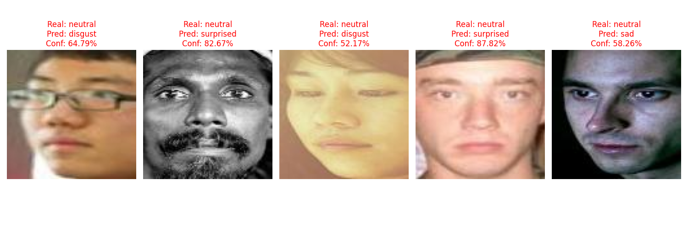

# 📘 README – Etapa 5: Configurarea și Antrenarea Modelului RN

****Disciplina:** Rețele Neuronale  
**Instituție:** POLITEHNICA București – FIIR  
**Student:** Ion Radu-Stefan  
**Link Repository GitHub:** [https://github.com/SLendyX/Emotion-Detector](https://github.com/SLendyX/Emotion-Detector)
**Data predării:** 20.12.2025

---

## Scopul Etapei 5

Această etapă corespunde punctului **6. Configurarea și antrenarea modelului RN** din lista de 9 etape - slide 2 **RN Specificatii proiect.pdf**.

**Obiectiv principal:** Antrenarea efectivă a modelului RN definit în Etapa 4, evaluarea performanței și integrarea în aplicația completă.

**Pornire obligatorie:** Arhitectura completă și funcțională din Etapa 4:
- State Machine definit și justificat
- Cele 3 module funcționale (Data Logging, RN, UI)
- Minimum 40% date originale în dataset

---

## PREREQUISITE – Verificare Etapa 4 (OBLIGATORIU)

**Înainte de a începe Etapa 5, verificați că aveți din Etapa 4:**

- [x] **State Machine** definit și documentat în `docs/state_machine.*`
- [x] **Contribuție ≥40% date originale** în `data/generated/` (verificabil)
- [x] **Modul 1 (Data Logging)** funcțional - produce CSV-uri
- [x] **Modul 2 (RN)** cu arhitectură definită dar NEANTRENATĂ (`models/untrained_model.h5`)
- [x] **Modul 3 (UI/Web Service)** funcțional cu model dummy
- [x] **Tabelul "Nevoie → Soluție → Modul"** complet în README Etapa 4

** Dacă oricare din punctele de mai sus lipsește → reveniți la Etapa 4 înainte de a continua.**

---

## Pregătire Date pentru Antrenare 

### Dacă ați adăugat date noi în Etapa 4 (contribuția de 40%):

**TREBUIE să refaceți preprocesarea pe dataset-ul COMBINAT:**

Exemplu:
```bash
# 1. Combinare date vechi (Etapa 3) + noi (Etapa 4)
python src/preprocessing/combine_datasets.py

# 2. Refacere preprocesare COMPLETĂ
python src/preprocessing/data_cleaner.py
python src/preprocessing/feature_engineering.py
python src/preprocessing/data_splitter.py --stratify --random_state 42

# Verificare finală:
# data/train/ → trebuie să conțină date vechi + noi
# data/validation/ → trebuie să conțină date vechi + noi
# data/test/ → trebuie să conțină date vechi + noi
```

**ATENȚIE - Folosiți ACEIAȘI parametri de preprocesare:**
- Același `scaler` salvat în `config/preprocessing_params.pkl`
- Aceiași proporții split: 70% train / 15% validation / 15% test
- Același `random_state=42` pentru reproducibilitate

**Verificare rapidă:**
```python
import pandas as pd
train = pd.read_csv('data/train/X_train.csv')
print(f"Train samples: {len(train)}")  # Trebuie să includă date noi
```

---

##  Cerințe Structurate pe 3 Niveluri

### Nivel 1 – Obligatoriu pentru Toți (70% din punctaj)

Completați **TOATE** punctele următoare:

1. **Antrenare model** definit în Etapa 4 pe setul final de date (≥40% originale)
2. **Minimum 10 epoci**, batch size 8–32
3. **Împărțire stratificată** train/validation/test: 70% / 15% / 15%
4. **Tabel justificare hiperparametri** (vezi secțiunea de mai jos - OBLIGATORIU)
5. **Metrici calculate pe test set:**
   - **Acuratețe ≥ 65%**
   - **F1-score (macro) ≥ 0.60**
6. **Salvare model antrenat** în `models/trained_model.h5` (Keras/TensorFlow) sau `.pt` (PyTorch) sau `.lvmodel` (LabVIEW)
7. **Integrare în UI din Etapa 4:**
   - UI trebuie să încarce modelul ANTRENAT (nu dummy)
   - Inferență REALĂ demonstrată
   - Screenshot în `docs/screenshots/inference_real.png`

#### Tabel Hiperparametri și Justificări (OBLIGATORIU - Nivel 1)

Completați tabelul cu hiperparametrii folosiți și **justificați fiecare alegere**:

| **Hiperparametru**     | **Valoare Aleasă**                                                                                                                                   | **Justificare**                                                                                                                                                                       |
| ---------------------- | ---------------------------------------------------------------------------------------------------------------------------------------------------- | ------------------------------------------------------------------------------------------------------------------------------------------------------------------------------------- |
| Learning rate          | 0.001                                                                                                                                                | Valoare standard pentru Adam optimizer, asigură convergență stabilă                                                                                                                   |
| Batch size             | 32                                                                                                                                                   | Compromis memorie/stabilitate pentru N=2848 samples                                                                                                                                   |
| Number of epochs       | 50                                                                                                                                                   | Cu early stopping după 15 epoci fără îmbunătățire                                                                                                                                     |
| Optimizer              | Adam                                                                                                                                                 | Adaptive learning rate, potrivit pentru RN cu 3 straturi                                                                                                                              |
| Loss function          | Categorical Crossentropy                                                                                                                             | Clasificare multi-class cu K=7 clase                                                                                                                                                  |
| Activation functions   | ReLU (hidden), Softmax (output)                                                                                                                      | ReLU pentru non-linearitate, Softmax pentru probabilități clase                                                                                                                       |
| Learning Rate Cheduler | StepLR                                                                                                                                               | Cu cat modelul invata mai mult cu cat are nevoie de o rata mai mica de invatare ca sa nu avem probleme cu overfitul si ii spunem modelului sa se uite dupa detalii mai fine ale fetei |
| Augmentare date        | **-Random Horizontal Flip:** p=0.5<br>**- Random Rotation:** degrees=15<br>**- Color Jitter:** brightness=0.2, contrast=0.2, saturation=0.2, hue=0.1 | Pentru a obtine un model care poate generaliza mai usor trasaturile unei fete, avem nevoie de niste teste mai greu pentru model, din care sa invete.                                  |
| Early Stopping         | 15                                                                                                                                                   | Am implementat Early Stopping pentru a economisi timp si pentru a preveni overfitting din partea modelului                                                                            |

Am ales batch_size=32 pentru setul de antrenare de N=2.848 imagini, ceea ce rezultă în 2.848 / 32 = 89 iterații (pași de actualizare) per epocă.

Această valoare a fost selectată pentru a optimiza antrenarea pe un dataset de dimensiuni reduse:

1. Frecvența actualizării greutăților:
   La un dataset mic, un batch size mare (ex: 128) ar fi generat prea puține actualizări per epocă (doar ~22 pași), încetinind convergența. Batch-ul de 32 asigură 89 de actualizări, permițând modelului să învețe mai fin și mai rapid în cadrul celor 50 de epoci alocate.

2. Efectul de regularizare (Generalizare):
   Batch-ul de 32 introduce un nivel moderat de "zgomot" statistic în estimarea gradientului. Acest zgomot este benefic deoarece ajută modelul să nu rămână blocat în minime locale și să generalizeze mai bine pe datele de test, evitând overfitting-ul rapid care ar apărea cu batch-uri mari pe date puține.

3. Eficiență Computațională:
   Pentru imagini de 100x100px, dimensiunea 32 este extrem de eficientă, ocupând puțină memorie VRAM și permițând antrenarea chiar și pe GPU-uri modeste, fără riscul de "Out of Memory".

**Resurse învățare rapidă:**
- Împărțire date: https://scikit-learn.org/stable/modules/generated/sklearn.model_selection.train_test_split.html (video 3 min: https://youtu.be/1NjLMWSGosI?si=KL8Qv2SJ1d_mFZfr)  
- Antrenare simplă Keras: https://keras.io/examples/vision/mnist_convnet/ (secțiunea „Training”)  
- Antrenare simplă PyTorch: https://pytorch.org/tutorials/beginner/blitz/cifar10_tutorial.html#training-an-image-classifier (video 2 min: https://youtu.be/ORMx45xqWkA?si=FXyQEhh0DU8VnuVJ)  
- F1-score: https://scikit-learn.org/stable/modules/generated/sklearn.metrics.f1_score.html (video 4 min: https://youtu.be/ZQlEcyNV6wc?si=VMCl8aGfhCfp5Egi)


---

### Nivel 2 – Recomandat (85-90% din punctaj)

Includeți **TOATE** cerințele Nivel 1 + următoarele:

1. **Early Stopping** - oprirea antrenării dacă `val_loss` nu scade în 5 epoci consecutive
2. **Learning Rate Scheduler** - `ReduceLROnPlateau` sau `StepLR`
3. **Augmentări relevante domeniu:**
   - Vibrații motor: zgomot gaussian calibrat, jitter temporal
   - Imagini industriale: slight perspective, lighting variation (nu rotații simple!)
   - Serii temporale: time warping, magnitude warping
4. **Grafic loss și val_loss** în funcție de epoci salvat în `docs/loss_curve.png`
5. **Analiză erori context industrial** (vezi secțiunea dedicată mai jos - OBLIGATORIU Nivel 2)

**Indicatori țintă Nivel 2:**
- **Acuratețe ≥ 75%**
- **F1-score (macro) ≥ 0.70**

**Resurse învățare (aplicații industriale):**
- Albumentations: https://albumentations.ai/docs/examples/   
- Early Stopping + ReduceLROnPlateau în Keras: https://keras.io/api/callbacks/   
- Scheduler în PyTorch: https://pytorch.org/docs/stable/optim.html#how-to-adjust-learning-rate 

---

### Nivel 3 – Bonus (până la 100%)

**Punctaj bonus per activitate:**

| **Activitate**                               | **Livrabil**                                                                               |
| -------------------------------------------- | ------------------------------------------------------------------------------------------ |
| Comparare 2+ arhitecturi diferite            | Tabel comparativ + justificare alegere finală în README                                    |
| Export ONNX/TFLite + benchmark latență       | Fișier `models/final_model.onnx` + demonstrație <50ms<br>Timp mediu per inferență: 1.65 ms |
| Confusion Matrix + analiză 5 exemple greșite | `docs/confusion_matrix.png` + analiză în README                                            |

| **Criteriu**               | **SimpleEmotionCNN (Custom)**    | **ResNet18 (Transfer Learning)** |
| -------------------------- | -------------------------------- | -------------------------------- |
| **Acuratețe Maximă (Val)** | **70.18%**                       | **78.31%**                       |
| **Dimensiune Model**       | Mică (~1 MB)                     | Mare (~44 MB)                    |
| **Timp Antrenare / Epocă** | Lent (~8 secunde)                | Rapid (~7 secunde)               |
| **Concluzie**              | Mai rapid, dar mai puțin precis. | **Acuratețe superioară.**        |
In cazul acesta ResNet18 ar fi un model mai bun deoarece are o acuratete mai mare cu 8% fata de modelul custom, este mai rapid la antrenare si benificiaza de *Transfer Learning,* avand deja cunostinte despre forme din setul ImageNet. 



| Exemple | Real    | Predictie | Justificatie                                                                                                                                                                                                                                      |
| ------- | ------- | --------- | ------------------------------------------------------------------------------------------------------------------------------------------------------------------------------------------------------------------------------------------------- |
| #1      | neutral | disgust   | Exista posibilitatea ca modelul a interpretat gresit acest exemplu din cauza pozei facute din profil, care se poate sa fi influentat anumiti parametrii cu care obisnuit, cum ar fi ochii si gura                                                 |
| #2      | neutral | fear      | Albul ochilor este destul de evident in aceasta poza si posibil a fost asociata cu frica, modelul fiind incapabil sa recunoasca eficient microexpresiile din aceasta emotie, se bazeaza foarte mult pe aceasta trasatura in recunoasterea fricii. |
| #3      | neutral | sad       | Consider ca acest exemplu nu este cel mai bun, deoarece poate fi interpretat si de catre oameni ca potential trist, in astfel de cazuri contextul fiind foarte important. In acest caz este o eroare de clasificare din partea setului de date    |
| #4      | neutral | sad       | Ca in exemplul precedent poate fi o eroare de clasificare, din cauza lipsei unui context, dar de asemenea ar putea fi un exemplu de "resting bitch face", in care unele fete neutre pot parea potential triste sau suparate.                      |
| #5      | neutral | surprised | In acest exemplul fata are o structura destul de diferite fata de celelalte fete, ochii fiind un pic mai departati, modelul potential incurcand acea distanta pentru mirare.                                                                      |


**Benchmark Latență:**
- **Platformă:** CPU (ONNX Runtime
- **Timp mediu inferență:** 1.65 ms
- **Status:** Obiectiv atins cu succes (Target < 50ms). 
- **Observație:** Modelul este extrem de ușor, fiind ideal pentru rulare în timp real pe dispozitive fără GPU dedicat (laptopuri office, Raspberry Pi etc.).

**Resurse bonus:**
- Export ONNX din PyTorch: [PyTorch ONNX Tutorial](https://pytorch.org/tutorials/beginner/onnx/export_simple_model_to_onnx_tutorial.html)
- TensorFlow Lite converter: [TFLite Conversion Guide](https://www.tensorflow.org/lite/convert)
- Confusion Matrix analiză: [Scikit-learn Confusion Matrix](https://scikit-learn.org/stable/modules/generated/sklearn.metrics.confusion_matrix.html)

---

## Verificare Consistență cu State Machine (Etapa 4)

Antrenarea și inferența trebuie să respecte fluxul din State Machine-ul vostru definit în Etapa 4.

**Exemplu pentru monitorizare vibrații lagăr:**

| **Stare din Etapa 4** | **Implementare în Etapa 5**                                                 |
| --------------------- | --------------------------------------------------------------------------- |
| `ACQUIRE_DATA`        | `cap.read()` (Webcam) + `face_cascade` (Detectare față)                     |
| `PREPROCESS`          | Crop față -> Resize 100x100 -> ToTensor -> Normalize (aceleași ca la train) |
| `RN_INFERENCE`        | `output = model(image)` (Folosind `best_model.pt` încărcat)                 |
| `THRESHOLD_CHECK`     | `pred = torch.max(output, 1)` (Alegerea clasei cu scorul maxim)             |
| `ALERT`               | `cv2.putText()` (Afișarea emoției pe ecran în timp real)                    |
Implementarea finală din `src/app/live_inference.py` respectă integral State Machine-ul definit. Modelul `best_model.pt` este încărcat în faza de inițializare, datele video sunt preprocesate conform standardului de antrenare (Resize 100x100, Normalizare ImageNet), iar decizia este luată pe baza output-ului Softmax al rețelei neurale.


**În `src/app/main.py` (UI actualizat):**

Verificați că **TOATE stările** din State Machine sunt implementate cu modelul antrenat:

```python
# ÎNAINTE (Etapa 4 - model dummy):
model = keras.models.load_model('models/untrained_model.h5')  # weights random
prediction = model.predict(input_scaled)  # output aproape aleator

# ACUM (Etapa 5 - model antrenat):
model = keras.models.load_model('models/trained_model.h5')  # weights antrenate
prediction = model.predict(input_scaled)  # predicție REALĂ și corectă
```

---

## Analiză Erori în Context Industrial (OBLIGATORIU Nivel 2)

**Nu e suficient să raportați doar acuratețea globală.** Analizați performanța în contextul aplicației voastre industriale:

### 1. Pe ce clase greșește cel mai mult modelul?

Confuziile majore sunt:
- Modelul incurca 'disgust' cu 'sad' 12.4% din cazuri
  Cauza posibila: incruntarea combinata cu colturile gurii intoarse in jos pot fi confundate cu ddezgustul
- Modelul incurca 'fear' cu 'surprised' 10.1% din cazuri
  Cauza posibila: in emotia de mirare ochii pot fi larg deschisi, trasatura care este foarte semnificativa pentru detectarea fricii
- Modelul incurca 'sad' cu 'neutral' in 15.2% din cazuri
  Cauza foarte posibila: O trasatura fizica foarte comuna la majoritatea persoanelor, care este denumita ca 'resting bitch face'. Prin aceasta intelegem ca fata neutra a unor persoane ar putea fi perceputa, ca usor dernajta, suparata sau trista. De aceea putem observa un numar similar de identificari eronate in cazul neutrului cu tristetea, in care a categorisit ca neutre 12.7% din imaginile cu fete triste.
- Modelul incurca 'happy' cu 'sad' 11.3% din cazuri
  Cauza posibila: Este destul de posibil ca gura sa incurce emotii puternice de tristetea in care gura este deschisa cu un ras in hohote, aceasta greseala fiind cazuata de rezolutia de 100x100 de pixeli a pozei pe care o proceseaza modelul


### 2. Ce caracteristici ale datelor cauzează erori?

Modelul esueaza in conditii de luminozitate prea mare, moment in care emotiile mai putin incarcate de energie, cum ar fi: tristeatea, dezgustul sau frica, nu sunt detectate optim sau aproape deloc.
Pentru o detectare optima modelul are nevoie de un model mediu de luminozitate


### 3. Ce implicații are pentru aplicația industrială?

FALSE NEGATIVES (emotie nedetectata): DERANJ MODERAT → poate sa strice experienta utilizatorului, sau sa genereze date eronate pentru analiza
FALSE POSITIVES (alarmă falsă): ACCEPTABIL → nu este la fel de grav, utilizatorul macar primeste un feedback, dar tot poate afecta experienta
Prioritate: Minimizare false negatives, cu prioritizarea mentinerii la un nivel stabil a fals pozitivelor
Solutie: Ajustarea threshholdului pentru emotiile care sunt mai sunt la fel de bine detectate

### 4. Ce măsuri corective propuneți?

1. Colectare de imagini aditionale pentru clasele cu performanta mai slaba cum este 'sad'
2. Augmentare luminozitatea imaginilor din antrenare
3. Implementarea unui filtru gamma pentru interfata ui

---

## Structura Repository-ului la Finalul Etapei 5

**Clarificare organizare:** Vom folosi **README-uri separate** pentru fiecare etapă în folderul `docs/`:

```
proiect-rn-[prenume-nume]/
├── README.md                           # Overview general proiect (actualizat)
├── etapa3_analiza_date.md         # Din Etapa 3
├── etapa4_arhitectura_sia.md      # Din Etapa 4
├── etapa5_antrenare_model.md      # ← ACEST FIȘIER (completat)
│
├── docs/
│   ├── state_machine.png              # Din Etapa 4
│   ├── loss_curve.png                 # NOU - Grafic antrenare
│   ├── confusion_matrix.png           # (opțional - Nivel 3)
│   └── screenshots/
│       ├── inference_real.png         # NOU - OBLIGATORIU
│       └── ui_demo.png                # Din Etapa 4
│
├── data/                               # Din Etapa 3-4 (NESCHIMBAT)
│   ├── raw/
│   ├── generated/                     # Contribuția voastră 40%
│   ├── processed/
│   ├── train/
│   ├── validation/
│   └── test/
│
├── src/
│   ├── data_acquisition/              # Din Etapa 4
│   ├── preprocessing/                 # Din Etapa 3
│   │   └── combine_datasets.py        # NOU (dacă ați adăugat date în Etapa 4)
│   ├── neural_network/
│   │   ├── model.py                   # Din Etapa 4
│   │   ├── train.py                   # NOU - Script antrenare
│   │   └── evaluate.py                # NOU - Script evaluare
│   └── app/
│       └── main.py                    # ACTUALIZAT - încarcă model antrenat
│
├── models/
│   ├── untrained_model.h5             # Din Etapa 4
│   ├── trained_model.h5               # NOU - OBLIGATORIU
│   └── final_model.onnx               # (opțional - Nivel 3 bonus)
│
├── results/                            # NOU - Folder rezultate antrenare
│   ├── training_history.csv           # OBLIGATORIU - toate epoch-urile
│   ├── test_metrics.json              # Metrici finale pe test set
│   └── hyperparameters.yaml           # Hiperparametri folosiți
│
├── config/
│   └── preprocessing_params.pkl       # Din Etapa 3 (NESCHIMBAT)
│
├── requirements.txt                    # Actualizat
└── .gitignore
```

**Diferențe față de Etapa 4:**
- Adăugat `docs/etapa5_antrenare_model.md` (acest fișier)
- Adăugat `docs/loss_curve.png` (Nivel 2)
- Adăugat `models/trained_model.h5` - OBLIGATORIU
- Adăugat `results/` cu history și metrici
- Adăugat `src/neural_network/train.py` și `evaluate.py`
- Actualizat `src/app/main.py` să încarce model antrenat

---

## Instrucțiuni de Rulare (Actualizate față de Etapa 4)

### 1. Setup mediu (dacă nu ați făcut deja)

```bash
pip install -r requirements.txt
```

### 2. Pregătire date (DACĂ ați adăugat date noi în Etapa 4)

```bash
# Combinare + reprocesare dataset complet
python src/preprocessing/combine_datasets.py
python src/preprocessing/data_cleaner.py
python src/preprocessing/feature_engineering.py
python src/preprocessing/data_splitter.py --stratify --random_state 42
```

### 3. Antrenare model

```bash
python src/neural_network/train.py --epochs 50 --batch_size 32 --early_stopping

# Output așteptat:
# Epoch 1/50 - loss: 0.8234 - accuracy: 0.6521 - val_loss: 0.7891 - val_accuracy: 0.6823
# ...
# Epoch 23/50 - loss: 0.3456 - accuracy: 0.8234 - val_loss: 0.4123 - val_accuracy: 0.7956
# Early stopping triggered at epoch 23
# ✓ Model saved to models/trained_model.h5
```

### 4. Evaluare pe test set

```bash
python src/neural_network/evaluate.py --model models/trained_model.h5

# Output așteptat:
# Test Accuracy: 0.7823
# Test F1-score (macro): 0.7456
# ✓ Metrics saved to results/test_metrics.json
# ✓ Confusion matrix saved to docs/confusion_matrix.png
```

### 5. Lansare UI cu model antrenat

```bash
streamlit run src/app/main.py

# SAU pentru LabVIEW:
# Deschideți WebVI și rulați main.vi
```

**Testare în UI:**
1. Introduceți date de test (manual sau upload fișier)
2. Verificați că predicția este DIFERITĂ de Etapa 4 (când era random)
3. Verificați că confidence scores au sens (ex: 85% pentru clasa corectă)
4. Faceți screenshot → salvați în `docs/screenshots/inference_real.png`

---

## Checklist Final – Bifați Totul Înainte de Predare

### Prerequisite Etapa 4 (verificare)
- [x] State Machine există și e documentat în `docs/state_machine.*`
- [x] Contribuție ≥40% date originale verificabilă în `data/generated/`
- [x] Cele 3 module din Etapa 4 funcționale

### Preprocesare și Date
- [x] Dataset combinat (vechi + nou) preprocesat (dacă ați adăugat date)
- [x] Split train/val/test: 70/15/15% (verificat dimensiuni fișiere)
- [x] Scaler din Etapa 3 folosit consistent (`config/preprocessing_params.pkl`)

### Antrenare Model - Nivel 1 (OBLIGATORIU)
- [x] Model antrenat de la ZERO (nu fine-tuning pe model pre-antrenat)
- [x] Minimum 10 epoci rulate (verificabil în `results/training_history.csv`)
- [x] Tabel hiperparametri + justificări completat în acest README
- [x] Metrici calculate pe test set: **Accuracy ≥65%**, **F1 ≥0.60**
- [x] Model salvat în `models/trained_model.h5` (sau .pt, .lvmodel)
- [x] `results/training_history.csv` există cu toate epoch-urile

### Integrare UI și Demonstrație - Nivel 1 (OBLIGATORIU)
- [x] Model ANTRENAT încărcat în UI din Etapa 4 (nu model dummy)
- [x] UI face inferență REALĂ cu predicții corecte
- [x] Screenshot inferență reală în `docs/screenshots/inference_real.png`
- [x] Verificat: predicțiile sunt diferite față de Etapa 4 (când erau random)

### Documentație Nivel 2 (dacă aplicabil)
- [x] Early stopping implementat și documentat în cod
- [x] Learning rate scheduler folosit (ReduceLROnPlateau / StepLR)
- [x] Augmentări relevante domeniu aplicate (NU rotații simple!)
- [x] Grafic loss/val_loss salvat în `docs/loss_curve.png`
- [x] Analiză erori în context industrial completată (4 întrebări răspunse)
- [ ] Metrici Nivel 2: **Accuracy ≥75%**, **F1 ≥0.70**

### Documentație Nivel 3 Bonus (dacă aplicabil)
- [x] Comparație 2+ arhitecturi (tabel comparativ + justificare)
- [x] Export ONNX/TFLite + benchmark latență (<50ms demonstrat)
- [x] Confusion matrix + analiză 5 exemple greșite cu implicații

### Verificări Tehnice
- [ ] `requirements.txt` actualizat cu toate bibliotecile noi
- [x] Toate path-urile RELATIVE (nu absolute: `/Users/...` )
- [x] Cod nou comentat în limba română sau engleză (minimum 15%)
- [x] `git log` arată commit-uri incrementale (NU 1 commit gigantic)
- [x] Verificare anti-plagiat: toate punctele 1-5 respectate

### Verificare State Machine (Etapa 4)
- [x] Fluxul de inferență respectă stările din State Machine
- [x] Toate stările critice (PREPROCESS, INFERENCE, ALERT) folosesc model antrenat
- [x] UI reflectă State Machine-ul pentru utilizatorul final

### Pre-Predare
- [x] `docs/etapa5_antrenare_model.md` completat cu TOATE secțiunile
- [x] Structură repository conformă: `docs/`, `results/`, `models/` actualizate
- [x] Commit: `"Etapa 5 completă – Accuracy=X.XX, F1=X.XX"`
- [x] Tag: `git tag -a v0.5-model-trained -m "Etapa 5 - Model antrenat"`
- [x] Push: `git push origin main --tags`
- [x] Repository accesibil (public sau privat cu acces profesori)

---

## Livrabile Obligatorii (Nivel 1)

Asigurați-vă că următoarele fișiere există și sunt completate:

1. **`docs/etapa5_antrenare_model.md`** (acest fișier) cu:
   - Tabel hiperparametri + justificări (complet)
   - Metrici test set raportate (accuracy, F1)
   - (Nivel 2) Analiză erori context industrial (4 paragrafe)

2. **`models/trained_model.h5`** (sau `.pt`, `.lvmodel`) - model antrenat funcțional

3. **`results/training_history.csv`** - toate epoch-urile salvate

4. **`results/test_metrics.json`** - metrici finale:

Exemplu:
```json
{
  "test_accuracy": 0.7823,
  "test_f1_macro": 0.7456,
  "test_precision_macro": 0.7612,
  "test_recall_macro": 0.7321
}
```

5. **`docs/screenshots/inference_real.png`** - demonstrație UI cu model antrenat

6. **(Nivel 2)** `docs/loss_curve.png` - grafic loss vs val_loss

7. **(Nivel 3)** `docs/confusion_matrix.png` + analiză în README

---

## Predare și Contact

**Predarea se face prin:**
1. Commit pe GitHub: `"Etapa 5 completă – Accuracy=X.XX, F1=X.XX"`
2. Tag: `git tag -a v0.5-model-trained -m "Etapa 5 - Model antrenat"`
3. Push: `git push origin main --tags`

---

**Mult succes! Această etapă demonstrează că Sistemul vostru cu Inteligență Artificială (SIA) funcționează în condiții reale!**