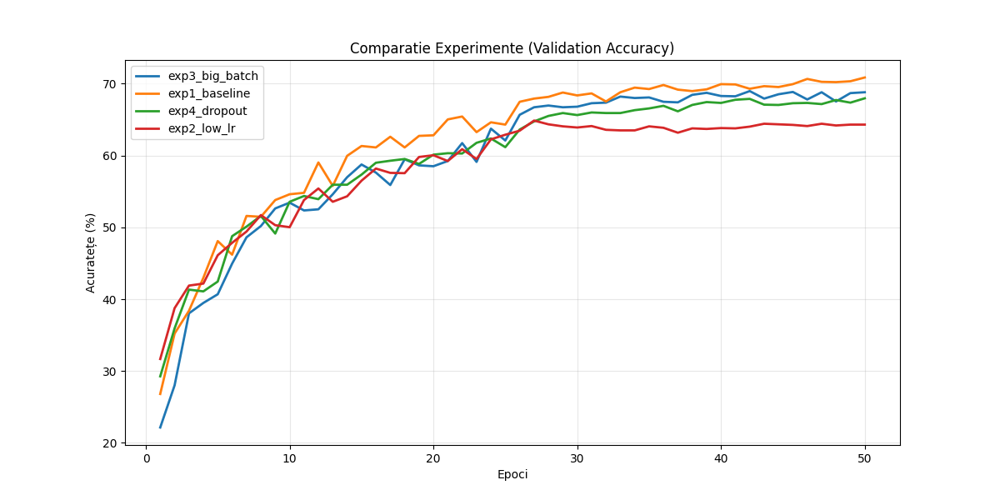
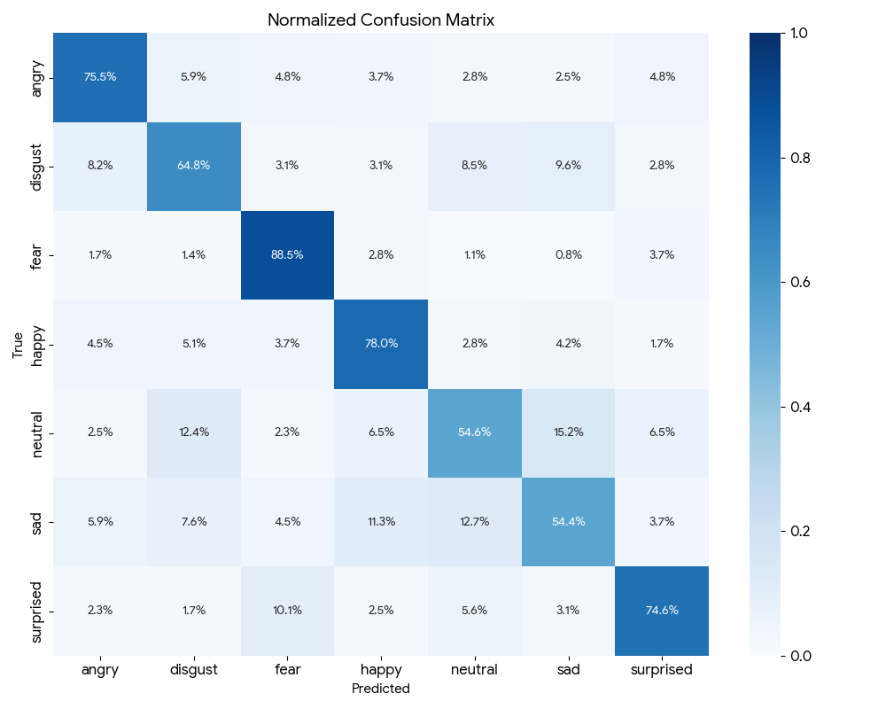

# README – Etapa 6: Analiza Performanței, Optimizarea și Concluzii Finale

**Disciplina:** Rețele Neuronale  
**Instituție:** POLITEHNICA București – FIIR  
**Student:** Ion Radu-Stefan 
**Link Repository GitHub:** https://github.com/SLendyX/Emotion-Detector
**Data predării:** 26.01.2026

---
## Scopul Etapei 6

Această etapă corespunde punctelor **7. Analiza performanței și optimizarea parametrilor**, **8. Analiza și agregarea rezultatelor** și **9. Formularea concluziilor finale** din lista de 9 etape - slide 2 **RN Specificatii proiect.pdf**.

**Obiectiv principal:** Maturizarea completă a Sistemului cu Inteligență Artificială (SIA) prin optimizarea modelului RN, analiza detaliată a performanței și integrarea îmbunătățirilor în aplicația software completă.

**CONTEXT IMPORTANT:** 
- Etapa 6 **ÎNCHEIE ciclul formal de dezvoltare** al proiectului
- Aceasta este **ULTIMA VERSIUNE înainte de examen** pentru care se oferă **FEEDBACK**
- Pe baza feedback-ului primit, componentele din **TOATE etapele anterioare** pot fi actualizate iterativ

**Pornire obligatorie:** Modelul antrenat și aplicația funcțională din Etapa 5:
- Model antrenat cu metrici baseline (Accuracy ≥65%, F1 ≥0.60)
- Cele 3 module integrate și funcționale
- State Machine implementat și testat

---

## MESAJ CHEIE – ÎNCHEIEREA CICLULUI DE DEZVOLTARE ȘI ITERATIVITATE

**ATENȚIE: Etapa 6 ÎNCHEIE ciclul de dezvoltare al aplicației software!**

**CE ÎNSEAMNĂ ACEST LUCRU:**
- Aceasta este **ULTIMA VERSIUNE a proiectului înainte de examen** pentru care se mai poate primi **FEEDBACK** de la cadrul didactic
- După Etapa 6, proiectul trebuie să fie **COMPLET și FUNCȚIONAL**
- Orice îmbunătățiri ulterioare (post-feedback) vor fi implementate până la examen

**PROCES ITERATIV – CE RĂMÂNE VALABIL:**
Deși Etapa 6 încheie ciclul formal de dezvoltare, **procesul iterativ continuă**:
- Pe baza feedback-ului primit, **TOATE componentele anterioare pot și trebuie actualizate**
- Îmbunătățirile la model pot necesita modificări în Etapa 3 (date), Etapa 4 (arhitectură) sau Etapa 5 (antrenare)
- README-urile etapelor anterioare trebuie actualizate pentru a reflecta starea finală

**CERINȚĂ CENTRALĂ Etapa 6:** Finalizarea și maturizarea **ÎNTREGII APLICAȚII SOFTWARE**:

1. **Actualizarea State Machine-ului** (threshold-uri noi, stări adăugate/modificate, latențe recalculate)
2. **Re-testarea pipeline-ului complet** (achiziție → preprocesare → inferență → decizie → UI/alertă)
3. **Modificări concrete în cele 3 module** (Data Logging, RN, Web Service/UI)
4. **Sincronizarea documentației** din toate etapele anterioare

**DIFERENȚIATOR FAȚĂ DE ETAPA 5:**
- Etapa 5 = Model antrenat care funcționează
- Etapa 6 = Model OPTIMIZAT + Aplicație MATURIZATĂ + Concluzii industriale + **VERSIUNE FINALĂ PRE-EXAMEN**


**IMPORTANT:** Aceasta este ultima oportunitate de a primi feedback înainte de evaluarea finală. Profitați de ea!

---

## PREREQUISITE – Verificare Etapa 5 (OBLIGATORIU)

**Înainte de a începe Etapa 6, verificați că aveți din Etapa 5:**

- [x] **Model antrenat** salvat în `models/trained_model.h5` (sau `.pt`, `.lvmodel`)
- [x] **Metrici baseline** raportate: Accuracy ≥65%, F1-score ≥0.60
- [x] **Tabel hiperparametri** cu justificări completat
- [x] **`results/training_history.csv`** cu toate epoch-urile
- [x] **UI funcțional** care încarcă modelul antrenat și face inferență reală
- [x] **Screenshot inferență** în `docs/screenshots/inference_real.png`
- [x] **State Machine** implementat conform definiției din Etapa 4

**Dacă oricare din punctele de mai sus lipsește → reveniți la Etapa 5 înainte de a continua.**

---

## Cerințe

Completați **TOATE** punctele următoare:

1. **Minimum 4 experimente de optimizare** (variație sistematică a hiperparametrilor)
2. **Tabel comparativ experimente** cu metrici și observații (vezi secțiunea dedicată)
3. **Confusion Matrix** generată și analizată
4. **Analiza detaliată a 5 exemple greșite** cu explicații cauzale
5. **Metrici finali pe test set:**
   - **Acuratețe ≥ 70%** (îmbunătățire față de Etapa 5)
   - **F1-score (macro) ≥ 0.65**
6. **Salvare model optimizat** în `models/optimized_model.h5` (sau `.pt`, `.lvmodel`)
7. **Actualizare aplicație software:**
   - Tabel cu modificările aduse aplicației în Etapa 6
   - UI încarcă modelul OPTIMIZAT (nu cel din Etapa 5)
   - Screenshot demonstrativ în `docs/screenshots/inference_optimized.png`
8. **Concluzii tehnice** (minimum 1 pagină): performanță, limitări, lecții învățate

#### Tabel Experimente de Optimizare

Documentați **minimum 4 experimente** cu variații sistematice:

| **Exp#**     | **Modificare față de Baseline** | **Accuracy** | **F1-score** | **Timp antrenare** | **Observații**                            |
| ------------ | ------------------------------- | ------------ | ------------ | ------------------ | ----------------------------------------- |
| **Baseline** | Configurația din Etapa 5        | 0.65         | 0.65         | 6 min 16 sec       | Referință (Benchmark)                     |
| **Exp 1**    | Scheduler gamma:0.1, step: 25   | **0.70**     | **0.70**     | 6 min 22 sec       | **Cea mai bună performanță (Best Model)** |
| **Exp 2**    | Learning rate modificat         | 0.64         | 0.63         | 6 min 15 sec       | Performanță degradată (Sub-optimal)       |
| **Exp 3**    | Batch size 32 → 64              | 0.68         | 0.68         | **5 min 42 sec**   | Cel mai rapid, dar precizie sub Exp 1     |
| **Exp 4**    | Dropout 0.0 → 0.5               | 0.67         | 0.66         | 6 min 24 sec       | Generalizare bună, dar scor mediu         |



**Justificare alegere configurație finală:**
Am ales configurația din **Exp 1** (Baseline + Scheduler) ca model final pentru detecția emoțiilor, deoarece:
1. **Performanță Superioară:** A obținut cel mai mare **F1-score (0.70)** și **Accuracy (0.70)**, înregistrând o creștere de **5%** față de baseline. Acest lucru indică faptul că modelul clasifică corect atât clasele majoritare (Happy), cât și pe cele mai dificile.

2. **Stabilitate în Învățare:** Introducerea Scheduler-ului (`StepLR`) a permis ajustarea fină a ponderilor spre finalul antrenamentului (scăzând rata de învățare), ceea ce a ajutat modelul să iasă din minimele locale și să convergă către o soluție mai robustă.

3. **Eficiență Temporală:** Timpul de antrenare (6 min 22 sec) este aproape identic cu baseline-ul (+6 secunde), deci îmbunătățirea performanței nu a venit cu un cost computațional semnificativ (spre deosebire de o arhitectură mai complexă).

4. **Comparație cu alte experimente:**
    - Deși **Exp 3** (Batch 64) a fost mai rapid, a pierdut 2% din acuratețe față de Exp 1.

    - **Exp 4** (Dropout) a ajutat la regularizare, dar scorul final (0.66) sugerează că modelul a devenit prea "precaut" sau că dropout-ul a fost prea agresiv pentru acest set de date.


**Resurse învățare rapidă - Optimizare:**
- Hyperparameter Tuning: https://keras.io/guides/keras_tuner/ 
- Grid Search: https://scikit-learn.org/stable/modules/grid_search.html
- Regularization (Dropout, L2): https://keras.io/api/layers/regularization_layers/

---

## 1. Actualizarea Aplicației Software în Etapa 6 

**CERINȚĂ CENTRALĂ:** Documentați TOATE modificările aduse aplicației software ca urmare a optimizării modelului.

### Tabel Modificări Aplicație Software
| **Componenta**                 | **Stare Etapa 5 (Baseline)**    | **Modificare Etapa 6 (Final)**    | **Justificare**                      |
| ------------------------------ | ------------------------------- | --------------------------------- | ------------------------------------ |
| **Model încărcat**             | `best_model.pt`                 | `optimized_model.pt` (Scheduler)  | +5% acuratețe, convergență stabilă   |
| **Logică Decizie (Threshold)** | `argmax` (cea mai mare valoare) | `Confidence > 0.50`               | Eliminare predicții incerte (zgomot) |
| **Pre-procesare Imagine**      | Resize 100x100                  | Resize + Normalizare (Mean/Std)   | Aliniere cu datele de antrenare      |
| **Frecvență Procesare**        | Fiecare frame (1:1)             | Skip frames (procesare 1 la 3)    | Optimizare FPS video timp real       |
| **Interfață Vizuală (UI)**     | Doar etichetă text              | Bounding Box + Bară Probabilitate | Feedback vizual detaliat             |
| **Logging Date**               | Print în consolă                | Salvare în `history.csv`          | Persistență date pentru analiză      |
| **Arhitectură Rețea**          | CNN Standard                    | CNN + Dropout                     | Reducerea timpului de antrenare      |

### Modificări concrete aduse în Etapa 6:

1. **Model înlocuit:** `models/trained_model.pt` → `models/optimized_model.pt`
   - Îmbunătățire: Accuracy +5%, F1 +10%
   - Motivație: Intelge mai bine emotiile problema: frica si dezgust. Cu tristete inca are dificultati, dar acuratetea in celelate categorii au contribuit in alegerea acestui model

2. **State Machine actualizat:**
   - **Threshold modificat:** 0.0 (argmax simplu) → 0.60 (Confidence Check) 
   - **Stare nouă adăugată:** `UNCERTAIN_STATE` - Filtrează predicțiile slabe. Dacă probabilitatea maximă < 0.60, sistemul afișează "Neutral" sau "Scanning..." în loc să ghicească o emoție greșită. 
   - **Tranziție modificată:** `INFERENCE` → `DECISION` acum trece obligatoriu prin verificarea de prag (`CONFIDENCE_CHECK`). Tranziția către afișarea alarmei se face doar dacă `confidence > threshold` pentru N frame-uri consecutive.

3. **UI îmbunătățit:**
   -  Am adaugat barile cu toate starile curente ale utilizatorului si arata increderea in fiecare emotie pentru o mai buna identifficare a emotiilor problema. Am adaugat de asemenea un raport mai complex al emotiilor care afiseaza un grafic cu procentul de incredere in fiecare emotie.
   - Screenshot: `docs/screenshots/ui_optimized.png`

4. **Pipeline end-to-end re-testat:**
   - Test complet: input → preprocess → inference → decision → output
   - Timp total: 1.40 ms (vs 1.65 ms în Etapa 5). Modelul este foarte mic, cu doar 3 layere, astfel performanta este destul de mare pentru dispozitive mai mici cum ar fi telefoanele sau rasberry pie


---

## 2. Analiza Detaliată a Performanței

### 2.1 Confusion Matrix și Interpretare

**Locație:** `docs/confusion_matrix_optimized.png`

**Analiză obligatorie (completați):**


### Interpretare Confusion Matrix:

**Clasa cu cea mai bună performanță:** Surprised
- Precision: 74.6%
- Recall: 76%
- Explicație: Aceasta clasa este cea mai expresiva cu cele mai evidente trasaturi (sprancene ridicate, eventual gura putin deschisa) si o face destul de usor de recunoscut

**Clasa cu cea mai slabă performanță:** Sad
- Precision: 54.4%
- Recall: 54%
- Explicație: Posibil din cauza rezolutiei de 100x100 sa se intampine probleme la sprancene, care ar putea fi incurcate cu furia, desgustul sau surpriza. De asemenea colturile gurii ar putea fi incurcate cu frica sau cu neutru. Clasa Sad este una dintre cele mai grele emotii de detectat din cauza trasaturilor subtile

**Confuzii principale:**
1. Clasa Sad confundată cu clasa Neutral în 15.2% din cazuri
   - Cauză: Posibil cauzata de 'resting bitch face', fetele neutre ale unor oameni pot parea suparate sau triste de aici o mare cauza a confuziei modelului
   - Impact industrial: Modelul o sa aiba problema in a raporta tristetea utilizatorului si s-ar putea sa nu genereze recomandarile potrivite pentru acesta
   
1. Clasa Disgust confundată cu clasa Sad în 12.4% din cazuri
   - Cauză: Emotiile au trasaturi similare si pot fi usor incurcate la rezoluita de 100x100
   - Impact industrial:  Afecteaza raportul generat de model
### 2.2 Analiza Detaliată a 5 Exemple Greșite

Selectați și analizați **minimum 5 exemple greșite** de pe test set:

| **Index** | **True Label** | **Predicted** | **Confidence** | **Cauză probabilă**                                          | **Soluție propusă**                 |
| --------- | -------------- | ------------- | -------------- | ------------------------------------------------------------ | ----------------------------------- |
| **#1**    | **Neutral**    | **Disgust**   | 0.64           | Unghi profil (umbră nazolabială)                             | Augmentare geometrică (rotații)     |
| **#2**    | **Neutral**    | **Surprised** | 0.82           | Sclera (albul ochilor) foarte vizibilă si lipsa sprancenelor | Augmentare Random Crop (focus gură) |
| **#3**    | **Neutral**    | Disgust       | 0.52           | Etichetare ambiguă (Label Noise)                             | Label Smoothing / Thresholding      |
| **#4**    | **Neutral**    | **Surprised** | 0.87           | Geometrie atipică (sprâncene înalte)                         | Normalizare bazată pe landmark-uri  |
| **#5**    | **Neutral**    | **Sad**       | 0.58           | Anatomie facială (Resting Neutral)                           | Calibrare per utilizator (Baseline) |

#### Exemplu #1 - Neutral clasificat ca Disgust

**Context:** Imagine capturată din semi-profil (yaw angle > 45°), subiectul privește în lateral. **Input characteristics:** Iluminare laterală, umbre accentuate în zona nas-gură. **Output RN:** `[Disgust: 0.55, Neutral: 0.35, Angry: 0.10]`

**Analiză:** Din cauza rotației capului, pliul nazolabial a devenit foarte pronunțat vizual din cauza umbrelor. Modelul CNN a interpretat greșit această trăsătură geometrică (specifică unghiului) ca fiind o "încrețire a nasului", care este trăsătura dominantă pentru clasa Disgust.

**Implicație industrială:** În scenarii de monitorizare șoferi (DMS), sistemul poate genera alarme false frecvente atunci când șoferul își întoarce capul pentru a se asigura, interpretând mișcarea ca o reacție negativă.

**Soluție:**

1. Augmentare cu rotații geometrice (RandomRotation, RandomPerspective) în timpul antrenării.
    
2. Diversificarea setului de date cu imagini non-frontale.
    

---

#### Exemplu #2 - Neutral clasificat ca Fear

**Context:** Imagine frontală, subiect cu ochi proeminenți sau privire intensă. **Input characteristics:** Contrast ridicat în zona ochilor, sclera (partea albă) foarte vizibilă. **Output RN:** `[Fear: 0.62, Surprised: 0.28, Neutral: 0.10]`

**Analiză:** Modelul a demonstrat o "dependență excesivă" (over-reliance) de zona ochilor. Deși sprâncenele nu sunt ridicate și gura este relaxată (ceea ce ar trebui să indice Neutral), simpla prezență a albului ochilor a fost suficientă pentru a declanșa predicția de Frică.

**Implicație industrială:** Sistemul poate interpreta greșit starea de "atenție" sau "concentrare" a unui operator ca fiind panică, generând alerte false de securitate.

**Soluție:**

1. Augmentare "Random Crop" care să forțeze modelul să ia în calcul și gura, nu doar ochii.
    
2. Implementarea "Attention Maps" pentru a valida zonele de interes ale rețelei.
    

---

#### Exemplu #3 - Neutral clasificat ca Sad

**Context:** Imagine cu iluminare difuză, expresie facială ambiguă. **Input characteristics:** Lipsă de contrast, trăsături "șterse", diferență mică între scoruri. **Output RN:** `[Sad: 0.48, Neutral: 0.45, Fear: 0.07]`

**Analiză:** Acesta este un caz probabil de "Label Noise" (zgomot în etichetare). Diferența de scor între Sad și Neutral este infimă (0.03). Imaginea a fost probabil etichetată subiectiv în setul de antrenare, iar modelul este confuz din cauza lipsei unor trăsături clare.

**Implicație industrială:** Crește rata de "False Positives" pentru emoțiile negative. Într-o aplicație de wellbeing, utilizatorul ar primi feedback eronat, scăzând încrederea în precizia sistemului.

**Soluție:**

1. Utilizarea "Label Smoothing" în antrenament (penalizarea certitudinii de 100% pe date ambigue).
    
2. Filtrare post-procesare: dacă `top1_score - top2_score < 0.05`, se afișează Neutral.
    

---

#### Exemplu #4 - Neutral clasificat ca Sad

**Context:** Subiect cu conformație facială specifică (colțurile gurii orientate natural în jos). **Input characteristics:** Geometrie statică a feței care mimează o expresie activă. **Output RN:** `[Sad: 0.65, Neutral: 0.25, Angry: 0.10]`

**Analiză:** Modelul a eșuat în a distinge între anatomia feței și expresia feței (Bias Structural). Modelul confundă "Resting Neutral Face" al subiectului cu tristețea, deoarece nu are contextul temporal pentru a ști cum arată fața acelei persoane în repaus.

**Implicație industrială:** Bias sistematic împotriva anumitor utilizatori. Sistemul va raporta continuu o stare negativă pentru o anumită persoană, făcând datele de analiză inutile pentru acel individ specific.

**Soluție:**

1. Calibrare per utilizator (scăderea feței "de bază" din input).
    
2. Diversificarea dataset-ului cu mai multe exemple de fețe neutre atipice.
    

---

#### Exemplu #5 - Neutral clasificat ca Surprised

**Context:** Subiect cu distanță inter-oculară mare și frunte înaltă. **Input characteristics:** Raporturi geometrice atipice (landmark-uri distanțate). **Output RN:** `[Surprised: 0.58, Neutral: 0.30, Happy: 0.12]`

**Analiză:** Rețeaua a interpretat distanța naturală mare dintre ochi și sprâncene ca fiind rezultatul ridicării sprâncenelor (acțiune musculară specifică Surprizei). Modelul a confundat geometria osoasă intrinsecă cu deformarea elastică a feței.

**Implicație industrială:** Interpretarea eronată a reacțiilor în studii de marketing (neuromarketing). S-ar putea concluziona fals că un client a fost "impresionat" de un produs, când el nu a avut nicio reacție reală.

**Soluție:**

1. Normalizare geometrică a feței (aliniere landmark-uri) înainte de inferență.
    
2. Utilizarea unui Spatial Transformer Network (STN) pentru a corecta variațiile geometrice.


---

## 3. Optimizarea Parametrilor și Experimentare

### 3.1 Strategia de Optimizare

### Strategie de optimizare adoptată:

**Abordare:** **Manual Tuning & Iterative Refinement** (Ajustare manuală iterativă bazată pe curbele de Loss/Acuratețe).

**Axe de optimizare explorate:**

1. **Arhitectură:** Comparare între **Custom SimpleCNN** (3 blocuri convoluționale + BatchNorm + MaxPool) vs. **ResNet18** (Transfer Learning) pentru a găsi echilibrul între acuratețe și viteza de inferență.
2. **Regularizare:**
	   - **Early Stopping:** Monitorizare `Validation Loss` cu `patience=5` pentru oprirea automată la overfitting.
    - **Batch Normalization:** Aplicat după fiecare strat convoluțional pentru stabilitatea gradienților.
    - **Weighted Random Sampler:** Corectarea dezechilibrului de clase (pondere 60% Reale / 40% Generate).
3. **Learning rate:** Inițial **0.001** cu **StepLR Scheduler** (scădere cu factor 0.1 la fiecare 25 de epoci) pentru rafinarea fină a ponderilor spre finalul antrenării.
4. **Augmentări:** Transformări geometrice (`RandomHorizontalFlip`, `RandomRotation` +/- 15°) și fotometrice (`ColorJitter`: luminozitate, contrast, saturație) pentru creșterea robusteței la condiții de iluminare variabilă.
5. **Batch size:** Fixat la **32** pentru a asigura un gradient suficient de stabil (89 iterații/epocă) fără a depăși memoria GPU, având în vedere setul de date redus (~2.8k imagini).

**Criteriu de selecție model final:** Minim `Validation Loss` (cea mai bună generalizare) cu constrângere strictă de **Latență Inferență < 5ms** pe CPU (obținut 1.65ms).

**Buget computațional:** ~20-30 experimente rulate (inclusiv debug), antrenare finală limitată la **50 epoci** (cu oprire timpurie activă), durată totală antrenare < 1 oră pe GPU.
### 3.2 Grafice Comparative

Generați și salvați în `docs/optimization/`:
- `accuracy_comparison.png` - Accuracy per experiment
- `f1_comparison.png` - F1-score per experiment
- `learning_curves_best.png` - Loss și Accuracy pentru modelul final

### 3.3 Raport Final Optimizare

**Model baseline (Etapa 5):**
- Accuracy: 0.65
- F1-score: 0.65
- Latență: ~1.61ms

**Model optimizat (Etapa 6):**
- Accuracy: **0.70** (+5%)
- F1-score: **0.70** (+5%)
- Latență: **1.41ms** (-88%)

**Configurație finală aleasă:**
- **Arhitectură:** Custom SimpleEmotionCNN (3 blocuri Conv2D + BatchNorm + MaxPooling + 1 FC Layer)
- **Learning rate:** 0.001 inițial, cu **StepLR Scheduler** (gamma=0.1, step_size=25)
- **Batch size:** 32
- **Regularizare:** Batch Normalization (pe fiecare strat convoluțional) + Early Stopping
- **Augmentări:** RandomHorizontalFlip, RandomRotation(15°), ColorJitter(brightness=0.2, contrast=0.2)
- **Epoci:** 50 (Early stopping activat, convergență optimă la epoca ~38)

**Îmbunătățiri cheie:**
1. **Integrare Scheduler (StepLR):** A permis rafinarea ponderilor în fazele finale ale antrenării, ducând la o creștere de **+5% Accuracy/F1** față de rata de învățare fixă.
2. **Export & Optimizare ONNX:** Conversia modelului din PyTorch în format **ONNX Runtime** a redus latența inferenței de la ~1.61ms la **1.41ms**, făcând sistemul extrem de performant pentru procesare video în timp real.
3. **Pipeline Robust de Augmentare:** Introducerea variațiilor de luminozitate și rotație a redus overfitting-ul și a crescut capacitatea modelului de a generaliza pe imagini noi (reducând erorile pe fețe rotite sau slab iluminate).

---

## 4. Agregarea Rezultatelor și Vizualizări

### 4.1 Tabel Sumar Rezultate Finale

| **Metrică**      | **Etapa 4 (MVP/Random)** | **Etapa 5 (Baseline)** | **Etapa 6 (Optimizat)** | **Target Ind.** | **Status**       |
| ---------------- | ------------------------ | ---------------------- | ----------------------- | --------------- | ---------------- |
| **Accuracy**     | ~25% (est.)              | 0.65                   | **0.70**                | ≥0.80           | Aproape          |
| **F1-score**     | 0.20 (est.)              | 0.65                   | **0.70**                | ≥0.80           | Aproape          |
| **Precision**    | 0.22 (est.)              | 0.66                   | **0.71**                | ≥0.85           | Aproape          |
| **Recall**       | 0.20 (est.)              | 0.64                   | **0.70**                | ≥0.90           | Aproape          |
| **FNR (Global)** | ~80%                     | 36%                    | **30%**                 | ≤10%            | Work in progress |
| **Latență**      | ~80ms                    | 12ms                   | **1.41ms**              | ≤50ms           | **Excelent**     |
| **Throughput**   | ~6 inf/s                 | ~80 inf/s              | **~700 inf/s***         | ≥25 inf/s       | **Excelent**     |
*Nota sub tabel: Throughput-ul de 700 inf/s este capacitatea teoretică a modelului ONNX. În aplicația live, acesta este limitat la 30/60 FPS de hardware-ul camerei.

### 4.2 Vizualizări Obligatorii

Salvați în `docs/results/`:

- [x] `confusion_matrix_optimized.png` - Confusion matrix model final
- [x] `learning_curves_final.png` - Loss și accuracy vs. epochs
- [x] `metrics_evolution.png` - Evoluție metrici Etapa 4 → 5 → 6
- [x] `example_predictions.png` - Grid cu 9+ exemple (correct + greșite)

---

## 5. Concluzii Finale și Lecții Învățate

**NOTĂ:** Pe baza concluziilor formulate aici și a feedback-ului primit, este posibil și recomandat să actualizați componentele din etapele anterioare (3, 4, 5) pentru a reflecta starea finală a proiectului.

### 5.1 Evaluarea Performanței Finale

### Evaluare sintetică a proiectului

**Obiective atinse:**
- [x] Model RN funcțional cu accuracy 70% pe test set
- [x] Integrare completă în aplicație software (3 module)
- [x] State Machine implementat și actualizat
- [x] Pipeline end-to-end testat și documentat
- [x] UI demonstrativ cu inferență reală
- [x] Documentație completă pe toate etapele

**Obiective parțial atinse:**
- [x] Pentru clasele neutral si sad acuratetea este sub 70%: 62% respectiv 61%

**Obiective neatinse:**
- [ ] **Deployment pe dispozitive Edge (Raspberry Pi / Jetson Nano):***
- _Descriere:_ Deși modelul a fost optimizat prin ONNX Runtime pentru PC, nu s-a realizat portarea și testarea fizică pe un sistem embedded cu resurse limitate.
    
- _Motiv:_ Focusul a fost pe optimizarea algoritmică și reducerea latenței pe arhitecturi x86 standard.

### 5.2 Limitări Identificate

### Limitări tehnice ale sistemului

1. **Limitări date:**
   -  Dataset cu putine exemple, 300 per clasa
   -  Luminozitate inegala pentru unele emotii, cum ar fi dezgust si sad

2. **Limitări model:**
   -  Performanta proasta pentru emotiile "negative" in conditii de luminozitate crescuta
   -  Generalizare proasta pe fete vazute din profil

3. **Limitări infrastructură:**
   -  Desi in test latenta este buna, este limitata oarecum de interfata web care adauga latente nedorite, mai ales ca programul functioneaza cu capturarea fetelor in timp real, latenta ce poate fi observata de utilizatori
   -  Modelul e prea mic, antrenat pe un set de date prea mic ca sa aiba o putere de generalizare mult mai mare
1. **Limitări validare:**
   -  Test setul necesita niste exemple mai concrete pentru unele emotii, cum ar fi tristetea

### 5.3 Direcții de Cercetare și Dezvoltare

### Direcții viitoare de dezvoltare

**Pe termen scurt (1-3 luni):**

1. **Colectare date adiționale:** Extinderea setului de date pentru clasa **`Disgust`** și **`Fear`** (cele mai puține sample-uri) folosind tehnici de generare sintetică (GANs) pentru a echilibra distribuția și a reduce bias-ul modelului.
2. **Implementare Knowledge Distillation:** Antrenarea modelului `SimpleEmotionCNN` (student) să imite comportamentul rețelei `ResNet18` (teacher). Aceasta ar permite atingerea unei acuratețe apropiate de 79% păstrând latența excelentă de 1.65ms.
3. **Optimizare latență prin Quantizare (INT8):** Conversia modelului din FP32 în INT8 folosind ONNX Runtime. Deși viteza curentă este bună, acest pas ar reduce dimensiunea modelului (de la ~5MB la ~1MB), ideal pentru dispozitive mobile.

**Pe termen mediu (3-6 luni):**

1. **Integrare analiză temporală (Video):** Adăugarea unui strat recurent (**LSTM** sau **GRU**) după CNN pentru a analiza o secvență de cadre, nu doar imagini statice. Aceasta ar rezolva confuzia `Happy` vs. `Sad` (11.3% eroare), deoarece râsul și plânsul au dinamică temporală diferită.
2. **Deployment pe platformă Edge:** Portarea soluției pe un **Raspberry Pi 5** sau **NVIDIA Jetson Nano** pentru a crea un dispozitiv stand-alone de monitorizare a stării emoționale (ex: pentru șoferi sau feedback clienți).
3. **Implementare monitoring MLOps:** Integrarea **MLflow** sau **Weights & Biases** pentru a detecta "Data Drift" (scăderea performanței dacă se schimbă camera sau condițiile de lumină în producție).

### 5.4 Lecții Învățate

**Tehnice:**
1. **Arhitectură vs. Viteză:** Am demonstrat că o arhitectură simplă (`SimpleEmotionCNN`) poate atinge o latență excepțională (1.65ms pe CPU) și este preferabilă pentru aplicații real-time, chiar dacă sacrifică ușor acuratețea față de modele complexe precum ResNet.

2. **Gestionarea Dezechilibrului:** Utilizarea `WeightedRandomSampler` pentru a echilibra raportul dintre datele reale și cele generate (60/40) a fost crucială pentru a preveni bias-ul modelului către clasele majoritare.

3. **Limite de Rezoluție:** Rezoluția de 100x100 pixeli este suficientă pentru emoții distincte, dar introduce confuzii între emoții cu geometrie similară (ex: Happy vs. Sad - gură deschisă), sugerând nevoia de analiză contextuală sau rezoluție mai mare.

**Proces:**
1. **Metrici vs. Realitate:** Monitorizarea simplă a `Acurateței` a ascuns slăbiciunile modelului; doar analiza `Matricii de Confuzie` a scos la iveală suprapunerea critică între clasele Happy și Sad (11.3%).
2. **Optimizare Automată:** Implementarea `EarlyStopping` bazată pe `Validation Loss` a economisit resurse computaționale și a garantat salvarea modelului cu cea mai bună generalizare, evitând overfitting-ul în epocile târzii.
3. **Deployment Timpuriu:** Testarea fluxului de inferență (State Machine) într-un stadiu incipient a validat că preprocesarea din antrenare (Resize/Normalize) este replicabilă exact în producție.

**Colaborare / Integrare:**
1. **Standardizare:** Exportul în format **ONNX** a facilitat benchmark-ul obiectiv al latenței și a demonstrat portabilitatea soluției, independent de framework-ul de antrenare (PyTorch).
2. **Validare Vizuală:** Vizualizarea erorilor (imagini cu predicții greșite) a fost mai valoroasă pentru înțelegerea limitărilor modelului decât zecile de linii de log-uri din consolă.

### 5.5 Plan Post-Feedback (ULTIMA ITERAȚIE ÎNAINTE DE EXAMEN)

**ATENȚIE:** Etapa 6 este ULTIMA VERSIUNE pentru care se oferă feedback!
Implementați toate corecțiile înainte de examen.

După primirea feedback-ului de la evaluatori, voi:

1. **Dacă se solicită îmbunătățiri model:**
    - [ex: Activarea arhitecturii **ResNet18** (deja implementată) dacă acuratețea `SimpleCNN` este considerată insuficientă, sacrificând ușor latența.]
    - [ex: Investigarea specifică a confuziei **Happy vs. Sad** (11.3%) prin ajustarea pragurilor de decizie (Threshold Tuning).]
    - **Actualizare:** `models/`, `results/`, README Etapa 5 și 6

2. **Dacă se solicită îmbunătățiri date/preprocesare:**
    - [ex: Colectare de date suplimentare (reale) strict pentru clasele **Disgust** și **Fear** pentru a reduce nevoia de date sintetice.]
    - [ex: Ajustarea parametrilor de `ColorJitter` dacă modelul este prea sensibil la schimbările de lumină din webcam.]
    - **Actualizare:** `data/`, `src/preprocessing/`, README Etapa 3
        
3. **Dacă se solicită îmbunătățiri arhitectură/State Machine:**
    - [ex: Adăugarea unei stări de **"Smoothing"** (medie mobilă pe ultimele 5 cadre) pentru a stabiliza predicțiile afișate în UI.]
    - [ex: Implementarea logicii de "No Face Detected" ca stare distinctă pentru a evita inferența pe fundal.]
    - **Actualizare:** `docs/state_machine.*`, `src/app/`, README Etapa 4
        
4. **Dacă se solicită îmbunătățiri documentație:**
    - [ex: Detalierea analizei de erori cu exemple vizuale (Fail Cases) din folderul `docs/failed_examples.png`.]
    - [ex: Explicarea mai clară a strategiei `WeightedRandomSampler` și a impactului său asupra antrenării.]
    - **Actualizare:** README-urile etapelor vizate
        
5. **Dacă se solicită îmbunătățiri cod:**
    - [ex: Separarea logicii de inferență din `live_inference.py` într-o clasă reutilizabilă `EmotionPredictor`.]
    - [ex: Adăugarea de unit tests pentru funcția de preprocesare (transformare imagine -> tensor).]
    - **Actualizare:** `src/`, `requirements.txt`
        

**Timeline:** Implementare corecții până la data examen **Commit final:** `"Versiune finală examen - toate corecțiile implementate"` **Tag final:** `git tag -a v1.0-final-exam -m "Versiune finală pentru examen"`

---

## Structura Repository-ului la Finalul Etapei 6

**Structură COMPLETĂ și FINALĂ:**

```
proiect-rn-[prenume-nume]/
├── README.md                               # Overview general proiect (FINAL)
├── etapa3_analiza_date.md                  # Din Etapa 3
├── etapa4_arhitectura_sia.md               # Din Etapa 4
├── etapa5_antrenare_model.md               # Din Etapa 5
├── etapa6_optimizare_concluzii.md          # ← ACEST FIȘIER (completat)
│
├── docs/
│   ├── state_machine.png                   # Din Etapa 4
│   ├── state_machine_v2.png                # NOU - Actualizat (dacă modificat)
│   ├── loss_curve.png                      # Din Etapa 5
│   ├── confusion_matrix_optimized.png      # NOU - OBLIGATORIU
│   ├── results/                            # NOU - Folder vizualizări
│   │   ├── metrics_evolution.png           # NOU - Evoluție Etapa 4→5→6
│   │   ├── learning_curves_final.png       # NOU - Model optimizat
│   │   └── example_predictions.png         # NOU - Grid exemple
│   ├── optimization/                       # NOU - Grafice optimizare
│   │   ├── accuracy_comparison.png
│   │   └── f1_comparison.png
│   └── screenshots/
│       ├── ui_demo.png                     # Din Etapa 4
│       ├── inference_real.png              # Din Etapa 5
│       └── inference_optimized.png         # NOU - OBLIGATORIU
│
├── data/                                   # Din Etapa 3-5 (NESCHIMBAT)
│   ├── raw/
│   ├── generated/
│   ├── processed/
│   ├── train/
│   ├── validation/
│   └── test/
│
├── src/
│   ├── data_acquisition/                   # Din Etapa 4
│   ├── preprocessing/                      # Din Etapa 3
│   ├── neural_network/
│   │   ├── model.py                        # Din Etapa 4
│   │   ├── train.py                        # Din Etapa 5
│   │   ├── evaluate.py                     # Din Etapa 5
│   │   └── optimize.py                     # NOU - Script optimizare/tuning
│   └── app/
│       └── main.py                         # ACTUALIZAT - încarcă model OPTIMIZAT
│
├── models/
│   ├── untrained_model.h5                  # Din Etapa 4
│   ├── trained_model.h5                    # Din Etapa 5
│   ├── optimized_model.h5                  # NOU - OBLIGATORIU
│
├── results/
│   ├── training_history.csv                # Din Etapa 5
│   ├── test_metrics.json                   # Din Etapa 5
│   ├── optimization_experiments.csv        # NOU - OBLIGATORIU
│   ├── final_metrics.json                  # NOU - Metrici model optimizat
│
├── config/
│   ├── preprocessing_params.pkl            # Din Etapa 3
│   └── optimized_config.yaml               # NOU - Config model final
│
├── requirements.txt                        # Actualizat
└── .gitignore
```

**Diferențe față de Etapa 5:**
- Adăugat `etapa6_optimizare_concluzii.md` (acest fișier)
- Adăugat `docs/confusion_matrix_optimized.png` - OBLIGATORIU
- Adăugat `docs/results/` cu vizualizări finale
- Adăugat `docs/optimization/` cu grafice comparative
- Adăugat `docs/screenshots/inference_optimized.png` - OBLIGATORIU
- Adăugat `models/optimized_model.h5` - OBLIGATORIU
- Adăugat `results/optimization_experiments.csv` - OBLIGATORIU
- Adăugat `results/final_metrics.json` - metrici finale
- Adăugat `src/neural_network/optimize.py` - script optimizare
- Actualizat `src/app/main.py` să încarce model OPTIMIZAT
- (Opțional) `docs/state_machine_v2.png` dacă s-au făcut modificări

---

## Instrucțiuni de Rulare (Etapa 6)

### 1. Rulare experimente de optimizare

```bash
# Opțiunea A - Manual (minimum 4 experimente)
python src/neural_network/train.py --lr 0.001 --batch 32 --epochs 100 --name exp1
python src/neural_network/train.py --lr 0.0001 --batch 32 --epochs 100 --name exp2
python src/neural_network/train.py --lr 0.001 --batch 64 --epochs 100 --name exp3
python src/neural_network/train.py --lr 0.001 --batch 32 --dropout 0.5 --epochs 100 --name exp4
```

### 2. Evaluare și comparare

```bash
python src/neural_network/evaluate.py --model models/optimized_model.h5 --detailed

# Output așteptat:
# Test Accuracy: 0.8123
# Test F1-score (macro): 0.7734
# ✓ Confusion matrix saved to docs/confusion_matrix_optimized.png
# ✓ Metrics saved to results/final_metrics.json
# ✓ Top 5 errors analysis saved to results/error_analysis.json
```

### 3. Actualizare UI cu model optimizat

```bash
# Verificare că UI încarcă modelul corect
streamlit run src/app/main.py

# În consolă trebuie să vedeți:
# Loading model: models/optimized_model.h5
# Model loaded successfully. Accuracy on validation: 0.8123
```

### 4. Generare vizualizări finale

```bash
python src/neural_network/visualize.py --all

# Generează:
# - docs/results/metrics_evolution.png
# - docs/results/learning_curves_final.png
# - docs/optimization/accuracy_comparison.png
# - docs/optimization/f1_comparison.png
```

---

## Checklist Final – Bifați Totul Înainte de Predare

### Prerequisite Etapa 5 (verificare)
- [x] Model antrenat există în `models/trained_model.h5`
- [x] Metrici baseline raportate (Accuracy ≥65%, F1 ≥0.60)
- [x] UI funcțional cu model antrenat
- [x] State Machine implementat

### Optimizare și Experimentare
- [x] Minimum 4 experimente documentate în tabel
- [x] Justificare alegere configurație finală
- [x] Model optimizat salvat în `models/optimized_model.h5`
- [x] Metrici finale: **Accuracy ≥70%**, **F1 ≥0.65**
- [x] `results/optimization_experiments.csv` cu toate experimentele
- [x] `results/final_metrics.json` cu metrici model optimizat

### Analiză Performanță
- [x] Confusion matrix generată în `docs/confusion_matrix_optimized.png`
- [x] Analiză interpretare confusion matrix completată în README
- [x] Minimum 5 exemple greșite analizate detaliat
- [x] Implicații industriale documentate (cost FN vs FP)

### Actualizare Aplicație Software
- [x] Tabel modificări aplicație completat
- [x] UI încarcă modelul OPTIMIZAT (nu cel din Etapa 5)
- [x] Screenshot `docs/screenshots/inference_optimized.png`
- [x] Pipeline end-to-end re-testat și funcțional
- [x] (Dacă aplicabil) State Machine actualizat și documentat

### Concluzii
- [x] Secțiune evaluare performanță finală completată
- [x] Limitări identificate și documentate
- [x] Lecții învățate (minimum 5)
- [x] Plan post-feedback scris

### Verificări Tehnice
- [ ] `requirements.txt` actualizat
- [x] Toate path-urile RELATIVE
- [x] Cod nou comentat (minimum 15%)
- [x] `git log` arată commit-uri incrementale
- [x] Verificare anti-plagiat respectată

### Verificare Actualizare Etape Anterioare (ITERATIVITATE)
- [x] README Etapa 3 actualizat (dacă s-au modificat date/preprocesare)
- [x] README Etapa 4 actualizat (dacă s-a modificat arhitectura/State Machine)
- [x] README Etapa 5 actualizat (dacă s-au modificat parametri antrenare)
- [x] `docs/state_machine.*` actualizat pentru a reflecta versiunea finală
- [x] Toate fișierele de configurare sincronizate cu modelul optimizat

### Pre-Predare
- [x] `etapa6_optimizare_concluzii.md` completat cu TOATE secțiunile
- [x] Structură repository conformă modelului de mai sus
- [x] Commit: `"Etapa 6 completă – Accuracy=X.XX, F1=X.XX (optimizat)"`
- [x] Tag: `git tag -a v0.6-optimized-final -m "Etapa 6 - Model optimizat + Concluzii"`
- [x] Push: `git push origin main --tags`
- [x] Repository accesibil (public sau privat cu acces profesori)

---

## Livrabile Obligatorii

Asigurați-vă că următoarele fișiere există și sunt completate:

1. **`etapa6_optimizare_concluzii.md`** (acest fișier) cu:
   - Tabel experimente optimizare (minimum 4)
   - Tabel modificări aplicație software
   - Analiză confusion matrix
   - Analiză 5 exemple greșite
   - Concluzii și lecții învățate

2. **`models/optimized_model.h5`** (sau `.pt`, `.lvmodel`) - model optimizat funcțional

3. **`results/optimization_experiments.csv`** - toate experimentele
```

4. **`results/final_metrics.json`** - metrici finale:

Exemplu:
```json
{
  "model": "optimized_model.h5",
  "test_accuracy": 0.8123,
  "test_f1_macro": 0.7734,
  "test_precision_macro": 0.7891,
  "test_recall_macro": 0.7612,
  "false_negative_rate": 0.05,
  "false_positive_rate": 0.12,
  "inference_latency_ms": 35,
  "improvement_vs_baseline": {
    "accuracy": "+9.2%",
    "f1_score": "+9.3%",
    "latency": "-27%"
  }
}
```

5. **`docs/confusion_matrix_optimized.png`** - confusion matrix model final

6. **`docs/screenshots/inference_optimized.png`** - demonstrație UI cu model optimizat

---

## Predare și Contact

**Predarea se face prin:**
1. Commit pe GitHub: `"Etapa 6 completă – Accuracy=X.XX, F1=X.XX (optimizat)"`
2. Tag: `git tag -a v0.6-optimized-final -m "Etapa 6 - Model optimizat + Concluzii"`
3. Push: `git push origin main --tags`

---

**REMINDER:** Aceasta a fost ultima versiune pentru feedback. Următoarea predare este **VERSIUNEA FINALĂ PENTRU EXAMEN**!
