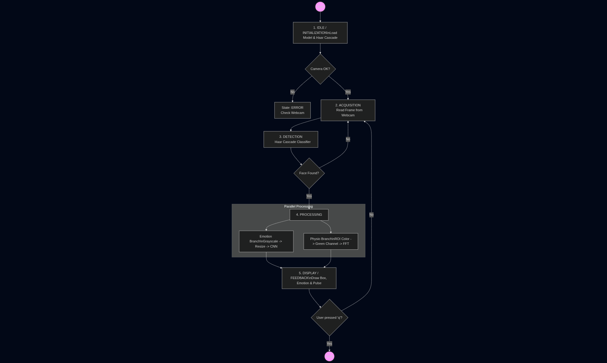

# 📘 README – Etapa 4: Arhitectura Completă a Aplicației SIA bazată pe Rețele Neuronale

**Disciplina:** Rețele Neuronale  
**Instituție:** POLITEHNICA București – FIIR  
**Student:** Ion Radu-Stefan  
**Link Repository GitHub:** [Adaugă link-ul tău aici]  
**Data:** 04.12.2025

---

## Scopul Etapei 4

Această etapă corespunde punctului **5. Dezvoltarea arhitecturii aplicației software bazată pe RN** din lista de 9 etape - slide 2 **RN Specificatii proiect.pdf**.

**Trebuie să livrați un SCHELET COMPLET și FUNCȚIONAL al întregului Sistem cu Inteligență Artificială (SIA). In acest stadiu modelul RN este doar definit și compilat (fără antrenare serioasă).**

### IMPORTANT - Ce înseamnă "schelet funcțional":

 **CE TREBUIE SĂ FUNCȚIONEZE:**
- Toate modulele pornesc fără erori
- Pipeline-ul complet rulează end-to-end (de la date → până la output UI)
- Modelul RN este definit și compilat (arhitectura există)
- Web Service/UI primește input și returnează output

 **CE NU E NECESAR ÎN ETAPA 4:**
- Model RN antrenat cu performanță bună
- Hiperparametri optimizați
- Acuratețe mare pe test set
- Web Service/UI cu funcționalități avansate

**Scopul anti-plagiat:** Nu puteți copia un notebook + model pre-antrenat de pe internet, pentru că modelul vostru este NEANTRENAT în această fază, dar funcțional ca și cod.

---

## 1. Diagrama State Machine (Mașina de Stări)

Această diagramă descrie logica de funcționare a aplicației `main_app.py`, care integrează recunoașterea emoțiilor și monitorizarea fiziologică.

*(Notă: Asigură-te că ai salvat diagrama în folderul docs/)*

### Legendă State Machine - Descriere Funcțională

Aplicația este guvernată de o mașină de stări finite care asigură procesarea în timp real a fluxului video:

1.  **IDLE / Initialization:** La pornire, sistemul încarcă modelul Rețelei Neuronale (`emotion_model.keras`) și clasificatorul Haar Cascade. De asemenea, inițializează buffer-ul pentru monitorizarea cardiacă (`HeartRateMonitor`). Dacă apar erori (ex: model lipsă), aplicația trece în starea de EROARE.
2.  **ACQUISITION (Video Capture):** Sistemul preia continuu cadre (frames) de la webcam-ul principal. Aceasta este starea de buclă principală.
3.  **DETECTION:** Pe cadrul curent se aplică algoritmul de detecție facială. 
    * *Tranziție:* Dacă se detectează o față -> Tranziție către PRE-PROCESSING. 
    * *Tranziție:* Dacă nu se detectează nimic -> Rămâne în ACQUISITION pentru următorul cadru.
4.  **PROCESSING & INFERENCE (Paralel):**
    * **Ramura Emoție:** ROI-ul feței (Region of Interest) este convertit la Grayscale, redimensionat la 48x48 și normalizat. Se execută inferența pe modelul CNN pentru a obține vectorul de probabilități.
    * **Ramura Fiziologică (rPPG):** ROI-ul feței (Color) este analizat de modulul `heart_rate.py`. Media canalului verde este adăugată în buffer-ul temporal, iar dacă buffer-ul este plin, se aplică FFT pentru a extrage pulsul (BPM).
5.  **DISPLAY / FEEDBACK:** Rezultatele celor două ramuri sunt agregate. Se calculează un "Diagnostic" (ex: Stres, Relaxare) și se suprapun elementele grafice (bounding box, text, bare de progres) peste cadrul original, care este afișat utilizatorului.

---

## 2. Stare Etapă (Checklist)

### General
- [x] Documentație finală: grafice + log + statistici în `docs/`
- [x] Diagrama State Machine creată și salvată în `docs/state_machine.png`
- [x] Legendă State Machine scrisă în README (vezi secțiunea de mai sus)
- [x] Repository structurat conform modelului (verificat consistență cu Etapa 3)

### Modul 1: Data Logging / Acquisition
- [x] Cod rulează fără erori (`python src/data_acquisition/capture_data.py`)
- [x] Produce minimum 40% date originale din dataset-ul final
- [x] Imagini generate sunt compatibile cu preprocesarea din Etapa 3 (48x48px, structură folder)
- [x] Documentație în `src/data_acquisition/README.md` cu:
  - **Metodă de generare:** Script Python (`capture_data.py`) care utilizează webcam-ul pentru a detecta fețele în timp real, le decupează automat și le salvează în format `.jpg` în directoare etichetate corespunzător (ex: `data/generated/neutral`).
  - **Parametri folosiți:** Rezoluție captură 48x48 pixeli (resize automat), format Grayscale, rată de captură manuală (la apăsarea tastei 's') pentru a asigura calitatea și diversitatea unghiurilor.
  - **Relevanță:** Datele proprii sunt esențiale pentru a calibra modelul la condițiile reale de iluminare și la trăsăturile specifice ale utilizatorului principal, crescând robusteța în utilizarea "live".
- [x] Fișiere în `data/generated/` conform structurii

### Modul 2: Neural Network
- [x] Arhitectură RN definită și documentată în cod (docstring detaliat în `train.py`)
- [x] README în `src/neural_network/` cu detalii arhitectură curentă:
    * **Tip:** Convolutional Neural Network (CNN) Secvențial.
    * **Structură:** 3 blocuri de convoluție (Conv2D + ReLU + MaxPooling) pentru extragerea trăsăturilor, urmate de straturi Dense pentru clasificare.
    * **Regularizare:** S-a utilizat `Dropout` (0.25 și 0.5) și `BatchNormalization` pentru a preveni overfitting-ul pe dataset-ul FER2013.
    * **Output:** Strat Softmax cu 7 neuroni (corespunzător celor 7 emoții).

### Modul 3: Web Service / UI
- [x] Propunere Interfață ce pornește fără erori (`python src/ui/main_app.py`)
- [x] Screenshot demonstrativ în `docs/screenshots/ui_demo.png`
- [x] Funcționalități implementate:
    * Detecție facială în timp real.
    * Afișare predicție emoție + scor de încredere (bară procentuală).
    * **Feature Unic:** Modul rPPG (`heart_rate.py`) integrat pentru estimarea pulsului pe baza variației culorii feței.
    * Afisare diagnostic combinat (Emoție + Puls).

---