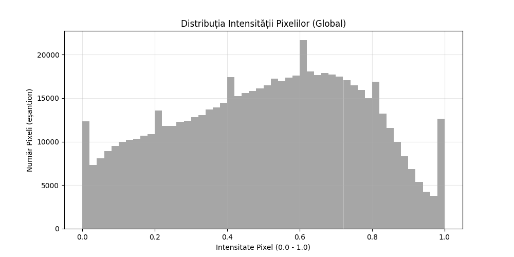
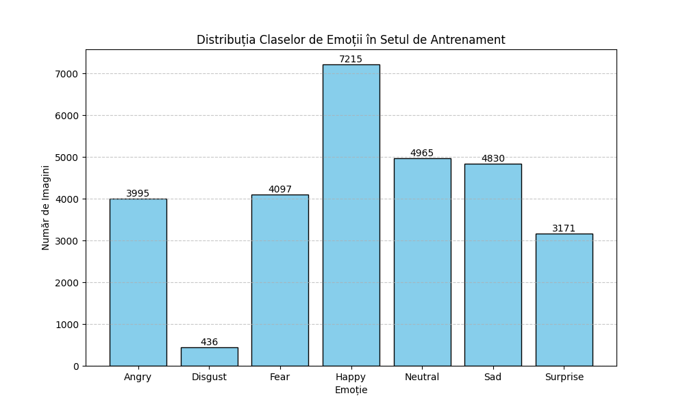
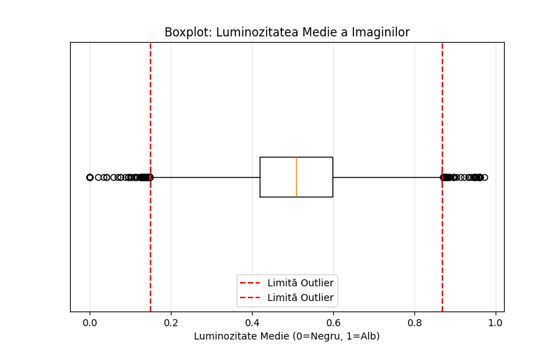

##  2. Descrierea Setului de Date

### 2.1 Sursa datelor

* **Origine:** [Dataset-ul FER2013 (Kaggle Challenge)](https://www.kaggle.com/datasets/msambare/fer2013)
* **Modul de achiziție:** Fișier extern (descărcat)
* **Perioada / condițiile colectării:** Date istorice, colectate pentru competiția ICML 2013

### 2.2 Caracteristicile dataset-ului

* **Număr total de observații:** Aprox. 35,887 imagini
* **Număr de caracteristici (features):** 2304 (48x48 pixeli) + 1 etichetă (emoția)
* **Tipuri de date:** Imagini (convertite în valori numerice de pixeli) și Categoriale (eticheta emoției)
* **Format fișiere:** CSV

### 2.3 Descrierea fiecărei caracteristici

| **Caracteristică** | **Tip** | **Unitate** | **Descriere** | **Domeniu valori** |
|-------------------|---------|-------------|---------------|--------------------|
| pixels | numeric (matrice) | intensitate | Valorile pixelilor imaginii grayscale (48x48) | 0-255 |
| emotion | categorial | - | Clasa emoției (0=Furie, 1=Dezgust, 2=Frică, 3=Fericire, 4=Tristețe, 5=Surpriză, 6=Neutru) | 0–6 |
| usage | categorial | - | Indică dacă exemplul este pentru Training/PublicTest/PrivateTest | {Training, Test} |

**Fișier recomandat:**  `data/README.md`

---

##  3. Analiza Exploratorie a Datelor (EDA) – Sintetic

### 3.1 Statistici descriptive aplicate

* **Medie, mediană, deviație standard** 

*Fig 1. Distribuția globală a intensității pixelilor. Forma de clopot indică o normalizare corectă.*

  * Medie: 0.5077 (Ideal ~0.5 pentru date normalizate)
  * Mediană: 0.5255
  * Deviație Standard: 0.2551

* **Min–max și quartile**
  * Min: 0.0, Max: 1.0
  * Q1 (25%): 0.3098
  * Q3 (75%): 0.7098

* **Distribuții pe caracteristici** (histograme)

*Fig 2. Dezechilibrul claselor în setul de antrenare. Se observă predominanța clasei "Happy".*

* **Identificarea outlierilor** (IQR / percentile)

*Fig 3. Identificarea imaginilor extreme (prea întunecate sau prea luminoase) folosind metoda IQR.*

  * IQR (Interquartile Range): 0.1799
  * Limita inferioară (Prea întunecat): 0.1491
  * Limita superioară (Prea luminos): 0.8687
  * Imagini outlier întunecate: 75
  * Imagini outlier luminoase: 45

### 3.2 Analiza calității datelor

* **Detectarea valorilor lipsă** (% pe coloană)
  * 0% valori lipsă: Nu s-au identificat valori nule (NaN) sau pixeli lipsă în matricele de imagini. Procesul de prelucrare a asigurat convertirea tuturor imaginilor valide în format numeric. Imaginile corupte (care nu au putut fi citite de OpenCV) au fost excluse automat în etapa de preprocesare.

* **Detectarea valorilor inconsistente sau eronate**
  * Outlieri de luminozitate: Folosind metoda IQR (Interquartile Range) pe luminozitatea medie a imaginilor, s-au identificat 120 de imagini potențial problematice:

    * 75 imagini "întunecate" (medie < 0.1491): Acestea sunt aproape negre și pot fi erori de captură sau ocluzii severe.

    * 45 imagini "supraexpuse" (medie > 0.8687): Imagini aproape albe, unde trăsăturile faciale pot fi pierdute.

  * Dezechilibru major de clase (Class Imbalance): Analiza distribuției claselor indică o inconsistență majoră în reprezentarea emoțiilor.

    * Clasa Happy este supra-reprezentată (7215 imagini).

    * Clasa Disgust este extrem de sub-reprezentată (doar 436 imagini).

    * Impact: Modelul riscă să învețe foarte bine să detecteze fericirea, dar să eșueze în detectarea dezgustului.

* **Identificarea caracteristicilor redundante sau puternic corelate**
  * Corelație spațială: În cazul datelor de tip imagine, pixelii adiacenți prezintă o corelație puternică (valori similare în vecinătate). Aceasta nu este considerată o redundanță negativă, ci o proprietate esențială pe care arhitectura CNN (Rețea Neuronală Convoluțională) o va exploata pentru a detecta contururi și forme.

  * Nu există coloane redundante (toți cei 2304 pixeli contribuie la imaginea de ansamblu).

### 3.3 Probleme identificate

* Dezechilibru sever între clase (Class Imbalance):

  * Aceasta este cea mai critică problemă. Clasa "Happy" conține 7215 exemple, în timp ce clasa "Disgust" conține doar 436 exemple.

  * Riscul: Modelul va avea tendința să prezică preponderent "Happy" (fiind varianta "sigură") și va ignora aproape complet "Disgust", deoarece nu are suficiente date pentru a învăța trăsăturile acesteia.

* Variații extreme de iluminare (Outlieri):

  * S-au identificat 120 de imagini outlier din punct de vedere statistic (prea întunecate sau supraexpuse).

  * Riscul: Imaginile cu luminozitate medie sub 0.15 (aproape negre) nu oferă suficiente informații despre contururi pentru straturile convoluționale (CNN), putând introduce "zgomot" în procesul de învățare.

* Ambiguitate vizuală (Overlap):

  * Vizualizarea eșantioanelor arată o similaritate structurală mare între anumite emoții, în special între "Fear" (Frică) și "Surprise" (Surpriză).

  * Riscul: Rezoluția mică (48x48 pixeli) face dificilă distingerea detaliilor fine (ex: forma ochilor vs. forma gurii) necesare pentru a diferenția aceste stări similare.

---

##  4. Preprocesarea Datelor

### 4.1 Curățarea datelor

* **Eliminare duplicatelor** 
  Scriptul de preprocesare a verificat integritatea fiecărui fișier de imagine folosind OpenCV. Imaginile care nu au putut fi citite (NoneType) au fost excluse automat din setul de date.

* **Tratarea valorilor lipsă:**
  * Pixeli: Nu s-au identificat valori lipsă în matricele de pixeli. Dataset-ul este dens.
  * Etichete: Toate imaginile procesate au avut o etichetă validă asociată (derivată din numele folderului).

* **Tratarea outlierilor:** IQR / limitare percentile 
  Deși s-au identificat imagini cu luminozitate extremă (prea întunecate/luminoase), acestea nu au fost eliminate. S-a optat pentru păstrarea lor pentru a crește robusteța modelului la condiții variate de iluminare, bazându-ne pe normalizare pentru a mitiga impactul negativ.

### 4.2 Transformarea caracteristicilor

* **Redimensionare (Resizing):**
  Toate imaginile au fost redimensionate la standardul de 48x48 pixeli pentru a asigura consistența tensorului de intrare.
* **Conversie Grayscale:**
  Imaginile au fost convertite (sau citite direct) în format alb-negru (1 canal), reducând complexitatea computațională față de imaginile RGB (3 canale).
* **Reshaping:** 
  Matricele de imagini au fost transformate din format 2D (48x48) în format 4D compatibil cu TensorFlow: `(număr_exemple, 48, 48, 1)`.
* **Normalizare:**
  Valorile pixelilor au fost scalate din intervalul `[0, 255]` în intervalul `[0, 1]` prin împărțirea la 255.0. Aceasta facilitează convergența mai rapidă a algoritmului de optimizare (Adam).
* **Encoding pentru variabile categoriale:**
  Etichetele emoțiilor (0-6) au fost transformate folosind One-Hot Encoding (ex: `3` $\rightarrow$ `[0, 0, 0, 1, 0, 0, 0]`) pentru a fi compatibile cu funcția de pierdere `categorical_crossentropy`.

### 4.3 Structurarea seturilor de date

**Organizarea datelor:**

  * Datele au fost procesate separat pentru setul de Antrenare (Train) și cel de Testare (Test), respectând structura de directoare originală a dataset-ului.

  * Stratificare: Deoarece s-au preluat toate imaginile din folderele originale, distribuția (dezechilibrată) a claselor s-a păstrat identic în fișierele procesate.

### 4.4 Salvarea rezultatelor preprocesării

  *Datele transformate au fost serializate și salvate în format binar NumPy (`.npy`) în directorul `data/processed/`. Acest format permite o încărcare ultra-rapidă în memorie la momentul antrenării, comparativ cu citirea individuală a zeci de mii de fișiere `.jpg`.

---

##  5. Fișiere Generate în Această Etapă

**Date Procesate (data/processed/)**
  * x_train.npy: Tensorul imaginilor de antrenare (normalizate, reshaped).

  * y_train.npy: Etichetele de antrenare (One-Hot Encoded).

  * x_test.npy: Tensorul imaginilor de testare.

  * y_test.npy: Etichetele de testare.

**Documentație Vizuală (docs/)**
  * distributie_clase.png: Histogramă care ilustrează dezechilibrul claselor.

  * esantioane_emotii.png: Colaj cu exemple aleatorii din fiecare categorie de emoție.

  * histograma_pixeli.png: Distribuția intensității pixelilor (verificarea normalizării).

  * boxplot_outlieri.png: Vizualizarea statistică a luminozității medii.

**Cod Sursă (src/)**
  * src/preprocessing/preprocess_data.py: Scriptul responsabil de curățare, transformare și salvare .npy.

  * src/analysis/detailed_stats.py: Scriptul pentru generarea rapoartelor statistice și a graficelor.

---

##  6. Stare Etapă (de completat de student)

- [X] Structură repository configurată
- [X] Dataset analizat (EDA realizată)
- [X] Date preprocesate
- [X] Seturi train/val/test generate
- [X] Documentație actualizată în README + `data/README.md`

---
